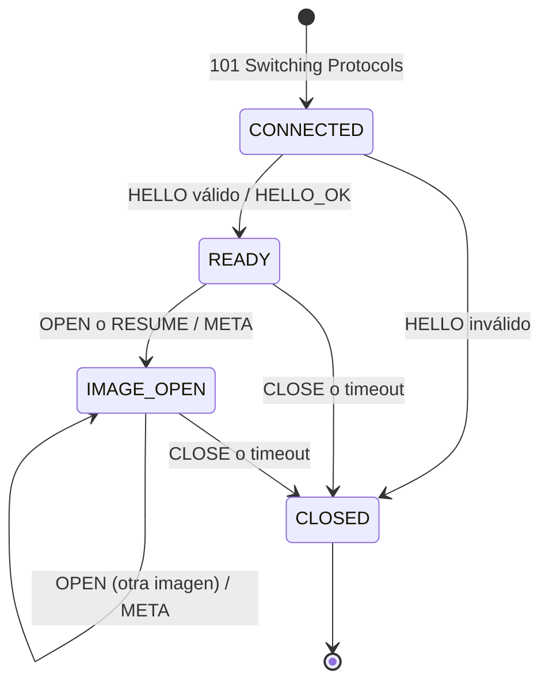
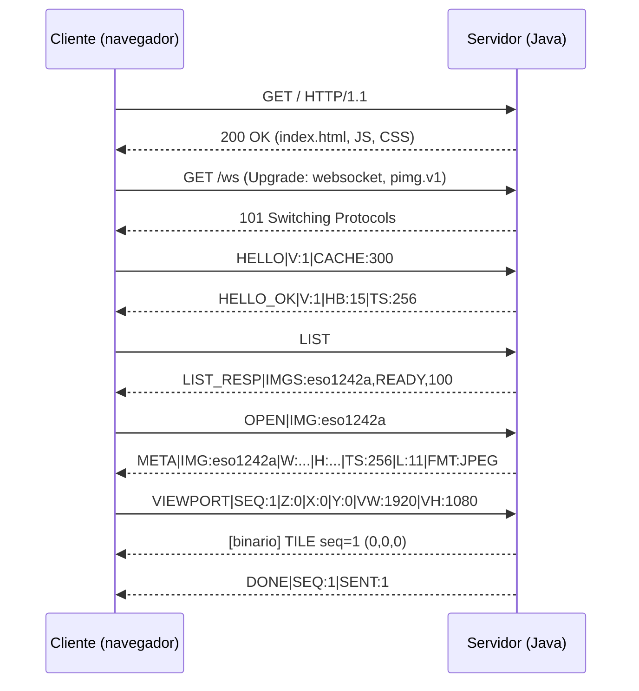

# Protocol Image (PIMG) — Especificación v0

**Proyecto:** Servidor Asíncrono de Imágenes — Ciencias de la Computación VIII
**Autores:** Marcos Masaya, Samuel Caal
**Versión del protocolo:** 1 (documento v0, borrador)

> Este documento es el **contrato** entre el servidor (Java) y el cliente (JS).
> Cualquier cambio de formato se hace primero aquí y luego en el código.
> Las palabras **DEBE**, **NO DEBE** y **PUEDE** se usan en el sentido de RFC 2119.

---

## 1. Objetivo

PIMG permite que un cliente explore una imagen de ultra alta resolución recibiendo **solo los fragmentos (tiles) que necesita para su vista actual**. El servidor mantiene, por cada cliente, el estado de la resolución que está viendo y de los tiles que ya le envió.

---

## 2. Pila de protocolos

```
┌───────────────────────────────┐
│ PIMG (este documento)         │  Qué tiles necesita cada cliente y en qué orden
├───────────────────────────────┤
│ WebSocket (RFC 6455)          │  Delimitación de mensajes; texto vs binario
├───────────────────────────────┤
│ HTTP/1.1 (RFC 9112)           │  Archivos iniciales + handshake de Upgrade
├───────────────────────────────┤
│ TCP (RFC 9293)                │  Entrega confiable y ordenada de bytes
└───────────────────────────────┘
```

**Responsabilidades:**

| Problema | Capa responsable |
|---|---|
| Pérdida, desorden, duplicación de bytes en la red | TCP |
| Límites entre mensajes | WebSocket |
| Distinguir comando (texto) de tile (binario) | WebSocket (opcodes 0x1 / 0x2) |
| Detección de conexión muerta | WebSocket PING/PONG, con período definido por PIMG |
| Identificar qué tile contiene cada mensaje binario | PIMG (cabecera) |
| Integridad extremo a extremo (disco → pantalla) | PIMG (CRC32) |
| Cancelar trabajo obsoleto | PIMG (`SEQ`, `CANCEL`) |
| Estado de resolución por cliente | PIMG (sesión) |
| Recuperación tras reconexión | PIMG (`RESUME`) |

---

## 3. Establecimiento de la conexión

1. El cliente obtiene `index.html`, JS y CSS por HTTP/1.1 desde el mismo servidor.
2. El cliente abre un WebSocket en la ruta **`/ws`**, proponiendo el subprotocolo **`pimg.v1`** (cabecera `Sec-WebSocket-Protocol`, RFC 6455 §1.9).
3. El servidor responde `101 Switching Protocols` incluyendo `Sec-WebSocket-Protocol: pimg.v1`.
   - Si el cliente no propone `pimg.v1`, el servidor DEBE responder `400 Bad Request`.
4. Desde ese momento la misma conexión TCP transporta frames WebSocket, y el primer mensaje del cliente DEBE ser `HELLO`.

---

## 4. Modelo de coordenadas

### 4.1 Pirámide de resolución

Sea una imagen de `W × H` píxeles y un tamaño de tile `T` (por defecto **256**).

- **Número de niveles:** `L = 1 + ⌈log₂(max(W, H) / T)⌉` (si `max(W,H) ≤ T`, entonces `L = 1`).
- Los niveles se numeran `z = 0 … L−1`.
  - `z = 0`: menor resolución; la imagen completa cabe en **un solo tile**.
  - `z = L−1`: resolución original.
- **Dimensiones del nivel `z`:** con `s = L − 1 − z`,
  - `W_z = ⌈W / 2^s⌉`
  - `H_z = ⌈H / 2^s⌉`
- **Tiles del nivel `z`:** `C_z = ⌈W_z / T⌉` columnas × `R_z = ⌈H_z / T⌉` filas.

**Ejemplo (estimado para ~100 GB RGB sin comprimir):** `W = H = 183 000`, `T = 256` → `L = 11`; el nivel 10 tiene 715 × 715 = 511 225 tiles.

### 4.2 Identificación de un tile

Un tile se identifica por `(z, x, y)`:
- `x`: columna, `0 ≤ x < C_z`, de izquierda a derecha.
- `y`: fila, `0 ≤ y < R_z`, de arriba hacia abajo.
- El tile `(z, x, y)` cubre los píxeles `[x·T, min((x+1)·T, W_z))` × `[y·T, min((y+1)·T, H_z))` del nivel `z`.
- Los tiles del borde derecho e inferior **PUEDEN ser menores que `T`**; no se rellenan.

**Relación de quadtree implícito:** los hijos de `(z, x, y)` son `(z+1, 2x, 2y)`, `(z+1, 2x+1, 2y)`, `(z+1, 2x, 2y+1)` y `(z+1, 2x+1, 2y+1)` (los que existan). La ubicación de un tile se calcula en O(1); no se recorre un árbol.

**Representación textual:** `z,x,y`. Una lista usa `;` como separador: `3,1,2;3,2,2`.

### 4.3 Viewport

El cliente describe su vista en **píxeles del nivel `z`**:
- `X, Y`: esquina superior izquierda de la vista (puede ser negativa si la imagen no llena la pantalla).
- `VW, VH`: ancho y alto de la vista en píxeles.

**Tiles visibles:**
- `x` desde `max(0, ⌊X / T⌋)` hasta `min(C_z − 1, ⌊(X + VW − 1) / T⌋)`
- `y` desde `max(0, ⌊Y / T⌋)` hasta `min(R_z − 1, ⌊(Y + VH − 1) / T⌋)`

El servidor DEBE enviar los tiles visibles **ordenados por distancia al centro de la vista** (los del centro primero).

---

## 5. Formato de mensajes de control (texto)

Los mensajes de control viajan en **frames de texto** WebSocket (opcode `0x1`), codificados en UTF-8.

### 5.1 Sintaxis

```
MENSAJE = COMANDO *( "|" CAMPO )
CAMPO   = CLAVE ":" VALOR
COMANDO = 1*( "A"-"Z" / "_" )
CLAVE   = 1*( "A"-"Z" / "_" )
VALOR   = *( cualquier carácter excepto "|" )
```

Reglas:
- El `VALOR` se separa de la `CLAVE` en el **primer** `:`.
- Una clave NO DEBE repetirse en el mismo mensaje.
- El orden de los campos no importa.
- Tamaño máximo de un mensaje de texto: **16 KB**.
- Identificadores de imagen: `[A-Za-z0-9_-]`, 1 a 64 caracteres.
- Números: enteros decimales en base 10.

Ejemplo: `VIEWPORT|SEQ:7|Z:4|X:512|Y:256|VW:1920|VH:1080`

### 5.2 Catálogo de comandos

| Comando | Dir. | Campos | Estado requerido | Respuesta |
|---|---|---|---|---|
| `HELLO` | C→S | `V` versión, `CACHE` máx. tiles en caché del cliente | `CONNECTED` | `HELLO_OK` o `ERROR` |
| `HELLO_OK` | S→C | `V`, `HB` segundos entre heartbeats, `TS` tamaño de tile | — | — |
| `LIST` | C→S | — | `READY` o `IMAGE_OPEN` | `LIST_RESP` |
| `LIST_RESP` | S→C | `IMGS` = `id,ESTADO,PROGRESO;…` | — | — |
| `OPEN` | C→S | `IMG` | `READY` o `IMAGE_OPEN` | `META` o `ERROR` |
| `META` | S→C | `IMG`, `W`, `H`, `TS`, `L`, `FMT` | — | — |
| `VIEWPORT` | C→S | `SEQ`, `Z`, `X`, `Y`, `VW`, `VH` | `IMAGE_OPEN` | tiles binarios + `DONE` |
| `GET_TILE` | C→S | `SEQ`, `Z`, `X`, `Y` | `IMAGE_OPEN` | 1 tile binario o `ERROR` |
| `EVICT` | C→S | `TILES` = lista `z,x,y;…` | `IMAGE_OPEN` | ninguna |
| `CANCEL` | C→S | `SEQ` | `IMAGE_OPEN` | ninguna |
| `RESUME` | C→S | `IMG`, `SEQ`, `HAVE` = lista `z,x,y;…` (puede ir vacía) | `READY` | `META` o `ERROR` |
| `DONE` | S→C | `SEQ`, `SENT` tiles enviados | — | — |
| `ERROR` | S→C | `CODE`, `MSG`, opcional `SEQ` | — | — |

**Estados de imagen en `LIST_RESP`:** `READY`, `PROCESSING` (con `PROGRESO` 0–100), `FAILED`.
**Formatos (`FMT`):** `JPEG`, `PNG`.

### 5.3 Semántica

**`HELLO`** — Negocia la versión. Si `V` no es soportada, el servidor responde `ERROR|CODE:426` y cierra con código 1002. `CACHE` indica cuántos tiles como máximo guardará el cliente; el servidor lo usa para acotar su registro de tiles enviados.

**`OPEN`** — Abre una imagen. Si ya había una abierta, el servidor DEBE vaciar la cola de envío y el registro de tiles enviados de esa sesión. Solo imágenes en estado `READY` pueden abrirse (si no, `ERROR|CODE:409`).

**`VIEWPORT`** — Mensaje principal. El servidor:
1. Actualiza el nivel actual de la sesión y el `SEQ` vigente.
2. Descarta de la cola todos los tiles pendientes con `SEQ` anterior.
3. Calcula los tiles visibles (§4.3) y **omite los que ya envió** a esta sesión.
4. Los encola del centro hacia afuera y los envía con el `SEQ` actual.
5. Al terminar, envía `DONE|SEQ:n|SENT:k`. Si llega un `VIEWPORT` nuevo antes de terminar, no se envía `DONE` para el anterior.

**`SEQ`** — Entero sin signo de 32 bits, **estrictamente creciente** por conexión, generado por el cliente.
- Un `VIEWPORT` con `SEQ` menor o igual al vigente DEBE ignorarse.
- `GET_TILE` y `CANCEL` usan el `SEQ` vigente o anterior; no lo actualizan.

**`GET_TILE`** — Pide un tile puntual (p. ej., tras un timeout). Se envía aunque figure como ya enviado.

**`EVICT`** — El cliente informa que liberó esos tiles de su memoria. El servidor DEBE quitarlos de su registro de enviados, para poder volver a enviarlos si reaparecen en la vista.

**`CANCEL`** — El servidor descarta de la cola todos los tiles con `SEQ` ≤ el indicado.

**`RESUME`** — Tras una reconexión: el cliente envía `HELLO` y luego `RESUME` con la imagen abierta, su último `SEQ` y la lista de tiles que aún conserva (`HAVE`). El servidor abre la imagen, inicializa su registro de enviados con `HAVE` y responde `META`. Así no reenvía lo que el cliente ya tiene. El servidor no conserva sesiones de conexiones cerradas.

**Recepción de tiles en el cliente** — El cliente DEBE aceptar un tile solo si `(z, x, y)` todavía pertenece a su vista actual o está pendiente por `GET_TILE`; en otro caso lo descarta. Si el CRC32 no coincide, lo descarta y lo solicita con `GET_TILE`.

---

## 6. Formato del mensaje de tile (binario)

Los tiles viajan en **frames binarios** WebSocket (opcode `0x2`), solo en dirección S→C. Todos los enteros son **big-endian** (orden de red) y **sin signo**.

```
 0       1       2               6       7               11              15      16              20              24
 ┌───────┬───────┬───────────────┬───────┬───────────────┬───────────────┬───────┬───────────────┬───────────────┬─────────
 │ VER   │ TIPO  │ SEQ           │ Z     │ X             │ Y             │ FMT   │ LONGITUD      │ CRC32         │ DATOS …
 │ 1 B   │ 1 B   │ 4 B           │ 1 B   │ 4 B           │ 4 B           │ 1 B   │ 4 B           │ 4 B           │
 └───────┴───────┴───────────────┴───────┴───────────────┴───────────────┴───────┴───────────────┴───────────────┴─────────
```

| Offset | Tamaño | Campo | Descripción |
|---|---|---|---|
| 0 | 1 | `VER` | Versión del protocolo (= 1) |
| 1 | 1 | `TIPO` | `0x01` = TILE (otros valores reservados) |
| 2 | 4 | `SEQ` | `SEQ` del `VIEWPORT` / `GET_TILE` que originó el envío |
| 6 | 1 | `Z` | Nivel |
| 7 | 4 | `X` | Columna |
| 11 | 4 | `Y` | Fila |
| 15 | 1 | `FMT` | `1` = JPEG, `2` = PNG |
| 16 | 4 | `LONGITUD` | Bytes de `DATOS` |
| 20 | 4 | `CRC32` | CRC-32 (ISO-HDLC, polinomio `0xEDB88320`) de `DATOS` |
| 24 | `LONGITUD` | `DATOS` | Imagen codificada del tile |

**Cabecera: 24 bytes.** Tamaño máximo de `DATOS`: **1 MB**.

Validaciones del receptor:
- `24 + LONGITUD` DEBE ser igual al tamaño del mensaje WebSocket.
- `VER`, `TIPO` y `FMT` DEBEN ser valores conocidos.
- El CRC32 calculado DEBE coincidir con el campo `CRC32`.

**Justificación del CRC32:** TCP protege los datos solo en la red y con un checksum de 16 bits. El CRC32 verifica el recorrido completo del tile (disco → código del servidor → red → cliente), siguiendo el argumento *end-to-end* (Saltzer, Reed y Clark, 1984).

---

## 7. Máquina de estados de la sesión



Un comando recibido en un estado no permitido produce `ERROR|CODE:412` sin cerrar la conexión.

---

## 8. Diagramas de secuencia

### 8.1 Arranque y primera vista



### 8.2 Navegación con cancelación

```mermaid
sequenceDiagram
    participant C as Cliente
    participant S as Servidor
    C->>S: VIEWPORT|SEQ:8|Z:5|...
    S-->>C: TILE seq=8 (5,10,4)
    S-->>C: TILE seq=8 (5,11,4)
    Note over C: El usuario se mueve antes de terminar
    C->>S: VIEWPORT|SEQ:9|Z:5|...
    Note over S: Descarta la cola de SEQ 8
    S-->>C: TILE seq=9 (5,14,4)
    S-->>C: DONE|SEQ:9|SENT:12
    C->>S: EVICT|TILES:5,10,4;5,11,4
```

### 8.3 Reconexión

```mermaid
sequenceDiagram
    participant C as Cliente
    participant S as Servidor
    Note over C,S: La conexión se cae
    C->>S: (nueva conexión) GET /ws Upgrade
    S-->>C: 101 Switching Protocols
    C->>S: HELLO|V:1|CACHE:300
    S-->>C: HELLO_OK|V:1|HB:15|TS:256
    C->>S: RESUME|IMG:eso1242a|SEQ:9|HAVE:5,14,4;5,15,4
    S-->>C: META|...
    C->>S: VIEWPORT|SEQ:10|Z:5|...
    Note over S: Omite 5,14,4 y 5,15,4
```

---

## 9. Heartbeat y cierre

- El servidor envía un frame **PING** (opcode `0x9`) cada `HB` segundos (por defecto 15).
- El navegador responde **PONG** (opcode `0xA`) automáticamente.
- Si el servidor no recibe ningún frame en `2 × HB` segundos, cierra la conexión.
- El cliente que detecta la caída reconecta con **backoff exponencial**: 1 s, 2 s, 4 s … máximo 30 s.

**Códigos de cierre WebSocket usados (RFC 6455 §7.4.1):**

| Código | Uso |
|---|---|
| 1000 | Cierre normal |
| 1002 | Error de protocolo (versión no soportada, frame inválido) |
| 1003 | Tipo de dato no aceptado (binario de cliente a servidor) |
| 1009 | Mensaje demasiado grande |
| 1011 | Error interno del servidor |

---

## 10. Códigos de error PIMG

| Código | Nombre | Cuándo | ¿Cierra? |
|---|---|---|---|
| 400 | `MALFORMED` | Mensaje con sintaxis inválida o campo faltante | No |
| 404 | `IMAGE_NOT_FOUND` | `OPEN`/`RESUME` con imagen inexistente | No |
| 409 | `IMAGE_NOT_READY` | Imagen en `PROCESSING` o `FAILED` | No |
| 412 | `INVALID_STATE` | Comando no permitido en el estado actual | No |
| 416 | `OUT_OF_RANGE` | `z`, `x` o `y` fuera de la pirámide | No |
| 426 | `VERSION_UNSUPPORTED` | Versión en `HELLO` no soportada | Sí (1002) |
| 500 | `INTERNAL` | Error al leer el tile u otro fallo del servidor | No |
| 503 | `BUSY` | Servidor saturado | No |

---

## 11. Control de flujo y límites

| Parámetro | Valor por defecto |
|---|---|
| Tamaño de tile | 256 px |
| Máx. mensaje de texto | 16 KB |
| Máx. datos de un tile | 1 MB |
| Cola de envío por sesión | 64 tiles |
| Heartbeat | 15 s |
| Timeout de `GET_TILE` en el cliente | 5 s, máx. 3 reintentos |

Si la cola de una sesión está llena, el servidor descarta los tiles **más antiguos** (backpressure), ya que corresponden a vistas que probablemente quedaron atrás.

---

## 12. Ejemplo de sesión completa

```
C: HELLO|V:1|CACHE:300
S: HELLO_OK|V:1|HB:15|TS:256
C: LIST
S: LIST_RESP|IMGS:eso1242a,READY,100;pano_demo,PROCESSING,42
C: OPEN|IMG:eso1242a
S: META|IMG:eso1242a|W:108199|H:81503|TS:256|L:10|FMT:JPEG
C: VIEWPORT|SEQ:1|Z:0|X:0|Y:0|VW:1920|VH:1080
S: [TILE seq=1 z=0 x=0 y=0 fmt=1 len=18342 crc=…]
S: DONE|SEQ:1|SENT:1
C: VIEWPORT|SEQ:2|Z:3|X:400|Y:120|VW:1920|VH:1080
S: [TILE seq=2 z=3 x=5 y=2 …] … (30 tiles, del centro hacia afuera)
S: DONE|SEQ:2|SENT:30
C: EVICT|TILES:0,0,0
C: OPEN|IMG:inexistente
S: ERROR|CODE:404|MSG:Imagen no encontrada
```

> Nota: las dimensiones de `eso1242a` en este ejemplo son ilustrativas; se reemplazarán por las reales al procesar la imagen.

---

## 13. Referencias

- RFC 2119 — *Key words for use in RFCs to Indicate Requirement Levels*.
- RFC 9110 — *HTTP Semantics*.
- RFC 9112 — *HTTP/1.1*.
- RFC 6455 — *The WebSocket Protocol*.
- RFC 9293 — *Transmission Control Protocol (TCP)*.
- RFC 3174 — *US Secure Hash Algorithm 1 (SHA1)* (handshake WebSocket).
- RFC 4648 — *The Base16, Base32, and Base64 Data Encodings* (handshake WebSocket).
- Saltzer, J., Reed, D., Clark, D. (1984). *End-to-End Arguments in System Design*. ACM TOCS.
- Stone, J., Partridge, C. (2000). *When the CRC and TCP Checksum Disagree*. ACM SIGCOMM.
- OSGeo — *Tile Map Service Specification*.
- IIIF — *Image API*.
- Microsoft — *Deep Zoom* (formato DZI), como antecedente de pirámides de tiles.

---

## Historial

| Versión doc. | Cambios |
|---|---|
| v0 | Borrador inicial: pila, coordenadas, comandos, cabecera binaria, estados, errores |