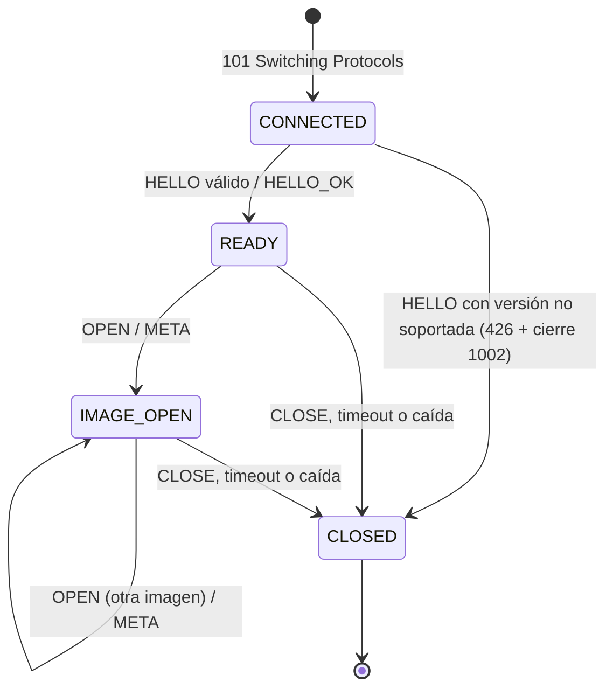

# PIMG — Protocol Image · Especificación

**Proyecto:** Servidor Asíncrono de Imágenes de Ultra Alta Resolución — Ciencias de la Computación VIII
**Autores:** Marcos Masaya, Samuel Caal
**Versión del protocolo:** 1 (`pimg.v1`) · **Documento:** v1.0
**Stack:** Java 21 sin dependencias externas (servidor) · HTML/CSS/JS con módulos ES (cliente)

> Este documento es el **contrato** entre servidor y cliente y la **fuente de verdad** del proyecto.
> Un cambio de formato se hace primero aquí y luego en el código (`src/pimg/protocol/` y `web/js/pimg.js`).
> Las palabras **DEBE**, **NO DEBE** y **PUEDE** se usan en el sentido de RFC 2119.
>
> **Estado de cada sección:** ✅ implementado y probado · 🟨 implementado parcialmente · 📝 diseño aprobado, no implementado.

---

## Índice

1. Objetivo y contexto de evaluación
2. Terminología
3. Pila de protocolos
4. Establecimiento de la conexión
5. Modelo de coordenadas (pirámide)
6. Vista (viewport)
7. Mensajes de control (texto)
8. Mensaje de tile (binario)
9. Máquina de estados de la sesión
10. Modelo de envío del servidor
11. Cachés
12. Comportamiento del cliente
13. Heartbeat y cierre
14. Códigos de error
15. Límites y parámetros
16. Ingesta y almacenamiento
17. Transporte PIMG v2 (control y recuperación) 📝
18. Decisiones de diseño
19. Resultados medidos
20. Pendientes
21. Referencias
22. Historial

---

## 1. Objetivo y contexto de evaluación

PIMG permite que un navegador explore imágenes de decenas o cientos de gigabytes **recibiendo solo los tiles que necesita para su vista actual**. El servidor mantiene, por cada cliente, el estado de lo que está viendo y de lo que ya le envió, y decide qué enviar, en qué orden y qué cancelar.

### 1.1 Requisitos del curso que condicionan el diseño

- El servidor (Java 20/21) atiende **múltiples clientes** y tiene un **protocolo propio** para controlar la resolución de cada cliente.
- HTTP se usa **solo** para los archivos iniciales; la imagen viaja por el protocolo propio.
- Ninguna petición a servidores externos; toda librería del frontend se aloja en el servidor. Se califica **sin internet**.
- La imagen **nunca** se envía completa en máxima calidad. El cliente **gestiona su memoria**.
- **No es una galería ni un simple zoom.** Tener niveles, versiones o coordenadas de la imagen **es solo la base y no puntúa**.
- Evaluación: **40 % funcionamiento y usabilidad, 60 % protocolo.** El protocolo debe gestionar la transmisión de forma eficiente y **no dejar al usuario desatendido**, incluso en la máxima definición.
- El protocolo debe usar o **adaptar** mecanismos de control y recuperación: Selective Repeat, Go-Back-N, SACK, ventana deslizante, control de flujo, control de congestión, Slow Start, etc.
- Se valida con las herramientas del navegador (DevTools): cantidad de peticiones y caché según las políticas del protocolo.
- Imágenes de evaluación: 17 GB, 28 GB, 55 GB y 93 GB (punteo máximo 20, 40, 80 y 115). Son **números dibujados con dígitos de 3×5 px** que deben **leerse claramente** en la máxima definición.
- El documento del protocolo debe explicar campos, estructuras, algoritmos y mecanismos de control (referencia: RFC 9293).

### 1.2 Idea central

La transmisión se trata como un **problema de transporte en unidades de tile**: el cliente informa su vista, el servidor decide qué enviar, cancela el trabajo de vistas abandonadas y (en v2) controla el ritmo con ventana deslizante, confirmaciones selectivas, control de flujo y de congestión, y recuperación **parcial por relevancia**.

Analogía de base de datos: cada tile es un registro con clave primaria `(z, x, y)`; la aritmética del quadtree es el índice; las cachés son el *buffer pool* con su política de reemplazo.

---

## 2. Terminología

| Término | Definición |
|---|---|
| **Tile** | Bloque de hasta `T × T` píxeles (`T = 256`) de un nivel de la pirámide |
| **Nivel `z`** | Una versión completa de la imagen a cierta resolución. `z = 0` es la menor |
| **Pirámide** | Conjunto de todos los niveles, cada uno la mitad del siguiente |
| **Vista (viewport)** | Rectángulo que el cliente muestra, en píxeles del nivel `z` |
| **Sesión** | Estado que el servidor guarda por conexión: imagen abierta, tiles enviados, `SEQ` vigente, cola |
| **`SEQ`** | Número de secuencia **de vista**, generado por el cliente, estrictamente creciente por conexión |
| **`TSN`** | (v2) Número de secuencia **de transmisión** de cada tile enviado, generado por el servidor |
| **Registro de enviados** | Conjunto de claves `(z,x,y)` que el servidor cree que el cliente tiene |
| **Pedido** | Entrada de la cola de envío: coordenadas de un tile o marca `DONE`. **No contiene bytes** |

---

## 3. Pila de protocolos ✅

```
┌───────────────────────────────┐
│ PIMG (este documento)         │  Qué tiles necesita cada cliente, orden, cancelación, recuperación
├───────────────────────────────┤
│ WebSocket (RFC 6455)          │  Delimitación de mensajes; texto (comandos) vs binario (tiles)
├───────────────────────────────┤
│ HTTP/1.1 (RFC 9112)           │  Archivos iniciales + handshake de Upgrade
├───────────────────────────────┤
│ TCP (RFC 9293)                │  Entrega confiable y ordenada de bytes
└───────────────────────────────┘
```

HTTP y WebSocket están **implementados a mano** sobre `java.net.Socket` (sin librerías).

| Problema | Capa responsable |
|---|---|
| Pérdida, desorden y duplicación de bytes en la red | TCP |
| Límites entre mensajes | WebSocket |
| Distinguir comando de tile | WebSocket (opcodes `0x1` / `0x2`) |
| Detección de conexión muerta | WebSocket PING/PONG, con período definido por PIMG |
| Identificar qué tile contiene cada mensaje binario | PIMG (cabecera) |
| Integridad extremo a extremo (disco → pantalla) | PIMG (CRC32) |
| Cancelar trabajo obsoleto | PIMG (`SEQ`, `CANCEL`) |
| Estado de resolución por cliente | PIMG (sesión) |
| Ritmo de envío, control de flujo y congestión, recuperación | PIMG v2 (§17) 📝 |

---

## 4. Establecimiento de la conexión ✅

### 4.1 HTTP/1.1 (archivos iniciales)

- Métodos: solo `GET`. Otro método → `405 Method Not Allowed` con `Allow: GET` y cierre de la conexión.
- Archivos servidos desde `web/`. Ruta `/` → `/index.html`.
- Protección contra *path traversal*: la ruta normalizada DEBE quedar dentro de `web/`; si no → `404`.
- `Content-Type` por extensión: `html`, `css`, `js` (`text/javascript`), `json`, `png`, `jpg`, `ico`.
- Envío por streaming (`Files.copy`), sin cargar el archivo en memoria.
- `Connection: keep-alive` por defecto en HTTP/1.1. Conexión inactiva 30 s → se cierra.
- El parser lee **byte por byte** (sin `BufferedReader`) para no consumir bytes de frames WebSocket que lleguen justo después del handshake.

### 4.2 Upgrade a WebSocket

El cliente abre `ws://<mismo host>/ws` proponiendo el subprotocolo **`pimg.v1`**. El servidor valida, en este orden:

| Condición | Si falla |
|---|---|
| Método `GET`, `Upgrade` contiene `websocket`, `Connection` contiene `upgrade` | `400` |
| `Sec-WebSocket-Version: 13` | `426 Upgrade Required` con `Sec-WebSocket-Version: 13` |
| `Sec-WebSocket-Key` es Base64 de 16 bytes | `400` |
| `Sec-WebSocket-Protocol` contiene `pimg.v1` | `400` |

Respuesta:

```
HTTP/1.1 101 Switching Protocols
Upgrade: websocket
Connection: Upgrade
Sec-WebSocket-Accept: Base64(SHA-1(clave + "258EAFA5-E914-47DA-95CA-C5AB0DC85B11"))
Sec-WebSocket-Protocol: pimg.v1
```

Verificado con el ejemplo de RFC 6455 §1.3: clave `dGhlIHNhbXBsZSBub25jZQ==` → `s3pPLMBiTxaQ9kYGzzhZRbK+xOo=`.

Desde el `101`, la misma conexión TCP transporta frames. El primer mensaje del cliente DEBE ser `HELLO`.

### 4.3 Frames (RFC 6455 §5)

- Del cliente al servidor: DEBEN venir **enmascarados**; si no → cierre `1002`.
- Del servidor al cliente: sin máscara y sin fragmentar (`FIN = 1`).
- Bits RSV activos → `1002`. Opcode desconocido → `1002`.
- Frames de control: carga ≤ 125 bytes y `FIN = 1`; si no → `1002`.
- Fragmentación del cliente: se reensambla (opcode `0x0`); límite total 16 KB.
- Texto que no es UTF-8 válido → `1007`.
- Mensaje de más de 16 KB → `1009` (se rechaza **antes** de leer la carga).
- PING → PONG automático con la misma carga.
- Escritura protegida con `ReentrantLock` (no `synchronized`, para no fijar el hilo virtual a su portador en Java 21).

---

## 5. Modelo de coordenadas (pirámide) ✅

### 5.1 Niveles

Imagen de `W × H` píxeles y tile `T = 256`.

**Número de niveles `L`:** se divide el lado mayor a la mitad (redondeando hacia arriba) hasta que quepa en un tile. Se usa aritmética entera, no `log₂` en punto flotante (evita errores de redondeo en potencias de 2).

```
L = 1; lado = max(W, H)
mientras lado > T:  lado = ⌈lado / 2⌉ ; L = L + 1
```

Equivale a `L = 1 + ⌈log₂(max(W,H) / T)⌉`.

- `z = 0`: menor resolución; la imagen completa cabe en un tile.
- `z = L − 1`: resolución original.
- Con `s = L − 1 − z`: `W_z = ⌈W / 2^s⌉`, `H_z = ⌈H / 2^s⌉`.
- Tiles del nivel: `C_z = ⌈W_z / T⌉` columnas × `R_z = ⌈H_z / T⌉` filas.

Implementación: `pimg.tiles.PyramidLayout` (servidor) y `anchoNivel/altoNivel` en `web/js/visor.js` (cliente). **Ambas DEBEN dar exactamente los mismos valores.**

### 5.2 Ejemplos reales

| Imagen | W × H | L | Tiles nivel máximo | Tiles totales |
|---|---|---|---|---|
| eso1242a TIFF 40K | 40 000 × 30 131 | 9 | 157 × 118 = 18 526 | 24 796 |
| eso1242a PSB | 108 199 × 81 503 | 10 | 423 × 319 = 134 937 | 180 189 |
| Evaluación 93 GB (PNG) | 176 393 × 176 393 | 11 | 690 × 690 = 476 100 | 635 214 |

### 5.3 Identificación de un tile

- `(z, x, y)`: `x` columna (izquierda → derecha), `y` fila (arriba → abajo), `0 ≤ x < C_z`, `0 ≤ y < R_z`.
- Cubre los píxeles `[x·T, min((x+1)·T, W_z)) × [y·T, min((y+1)·T, H_z))` del nivel `z`. Los tiles del borde derecho e inferior PUEDEN ser menores que `T`; no se rellenan.
- **Quadtree implícito:** hijos de `(z,x,y)` = `(z+1, 2x+i, 2y+j)` con `i,j ∈ {0,1}` (los que existan). Ancestro `k` niveles arriba = `(z−k, x >> k, y >> k)`. Todo en O(1), sin árbol explícito.
- **Texto:** `z,x,y`. Lista: separador `;` → `3,1,2;3,2,2`.
- **Clave interna del servidor (64 bits):** `z << 56 | x << 28 | y` (x, y < 2²⁸).

---

## 6. Vista (viewport) ✅

El cliente describe su vista en **píxeles del nivel `z`**: esquina superior izquierda `X, Y` (PUEDEN ser negativas) y tamaño `VW, VH`.

**Tiles visibles** (con división entera hacia −∞, `floorDiv`):

- `x` desde `max(0, ⌊X/T⌋)` hasta `min(C_z − 1, ⌊(X + VW − 1)/T⌋)`
- `y` desde `max(0, ⌊Y/T⌋)` hasta `min(R_z − 1, ⌊(Y + VH − 1)/T⌋)`

**Orden:** el servidor DEBE enviar los tiles **del centro hacia afuera**, ordenados por la distancia² entre el centro del tile `((x+0.5)·T, (y+0.5)·T)` y el centro de la vista `(X + VW/2, Y + VH/2)`.

**Límites:** `1 ≤ VW, VH ≤ 4096` y `X, Y ≥ −4096`. Impiden que un cliente pida un nivel entero de golpe.

Implementación: `pimg.protocol.Vista`.

---

## 7. Mensajes de control (texto)

Viajan en frames de texto (opcode `0x1`), en UTF-8.

### 7.1 Sintaxis ✅

```
MENSAJE = COMANDO *( "|" CAMPO )
CAMPO   = CLAVE ":" VALOR
COMANDO = 1*( "A"-"Z" / "_" )
CLAVE   = 1*( "A"-"Z" / "_" )
VALOR   = *( cualquier carácter excepto "|" )
```

- El `VALOR` empieza después del **primer** `:`.
- Una clave NO DEBE repetirse → `400`.
- El orden de los campos no importa.
- Máximo 16 KB por mensaje.
- Identificadores de imagen: `[A-Za-z0-9_-]{1,64}` (también impide rutas como `../`).
- Números: enteros decimales. Fuera de rango o no numérico → `400`.
- El servidor reemplaza `|` por `/` en los valores que genera (p. ej. `MSG`).

Implementación: `pimg.protocol.Mensaje`.

### 7.2 Catálogo

| Comando | Dir. | Campos | Estado requerido | Respuesta | Estado |
|---|---|---|---|---|---|
| `HELLO` | C→S | `V` (=1), `CACHE` (1–1 000 000) | `CONNECTED` | `HELLO_OK` o `ERROR` | ✅ |
| `HELLO_OK` | S→C | `V`, `HB` (s entre heartbeats), `TS` (tamaño de tile) | — | — | ✅ |
| `LIST` | C→S | — | `READY`, `IMAGE_OPEN` | `LIST_RESP` | ✅ |
| `LIST_RESP` | S→C | `IMGS` = `id,ESTADO,PROGRESO;…` | — | — | 🟨 solo `READY,100` |
| `OPEN` | C→S | `IMG` | `READY`, `IMAGE_OPEN` | `META` o `ERROR` | ✅ |
| `META` | S→C | `IMG`, `W`, `H`, `TS`, `L`, `FMT` | — | — | ✅ |
| `VIEWPORT` | C→S | `SEQ`, `Z`, `X`, `Y`, `VW`, `VH` | `IMAGE_OPEN` | tiles + `DONE` | ✅ |
| `GET_TILE` | C→S | `SEQ`, `Z`, `X`, `Y` | `IMAGE_OPEN` | 1 tile o `ERROR` | ✅ |
| `EVICT` | C→S | `TILES` = `z,x,y;…` (puede ir vacío) | `IMAGE_OPEN` | ninguna | ✅ |
| `CANCEL` | C→S | `SEQ` | `IMAGE_OPEN` | ninguna | ✅ |
| `DONE` | S→C | `SEQ`, `SENT` | — | — | ✅ |
| `ERROR` | S→C | `CODE`, `MSG` | — | — | ✅ |
| `RESUME` | C→S | `IMG`, `SEQ`, `HAVE` = `z,x,y;…` | `READY` | `META` o `ERROR` | 📝 |
| `ACK`, `FWD` | — | ver §17 | — | — | 📝 |

**Rangos numéricos:** `SEQ` ∈ [0, 2³²−1] · `Z` ∈ [0, 255] (y `< L`, si no `416`) · `X, Y` de `VIEWPORT` ∈ [−4096, 2³¹−1] · `X, Y` de `GET_TILE` ∈ [0, 2³¹−1] · `VW, VH` ∈ [1, 4096].

**Estados de imagen en `LIST_RESP`:** `READY`, `PROCESSING` (con `PROGRESO` 0–100) 📝, `FAILED` 📝.
**Formatos (`FMT`):** `JPEG`, `PNG`.

### 7.3 Semántica

**`HELLO`** — Negocia versión. `V ≠ 1` → `ERROR|CODE:426` y cierre `1002`. `CACHE` se valida pero en v1 el servidor no lo usa: confía en `EVICT` para mantener su registro.

**`LIST`** — El servidor relee el catálogo en cada `LIST` (una imagen procesada aparece sin reiniciar). Una imagen está `READY` si existe su `meta.json` (§16).

**`OPEN`** — Abre una imagen. El servidor DEBE: vaciar la cola de la sesión, vaciar el registro de enviados y responder `META`. Imagen inexistente → `404`. El `SEQ` NO se reinicia (sigue siendo creciente por conexión).

**`VIEWPORT`** — Mensaje principal. El servidor:
1. Si `SEQ ≤ SEQ vigente` → **ignora el mensaje** (sin respuesta).
2. Valida rangos (`Z ≥ L` → `416`).
3. Calcula los tiles visibles (§6), ordenados del centro hacia afuera.
4. Actualiza el `SEQ` vigente y **vacía la cola**: esto cancela todo lo pendiente de vistas anteriores, incluido su `DONE`.
5. Encola los tiles visibles que **no están en el registro de enviados**, hasta `COLA_MAX − 1`; si la vista tiene más, se quedan los del centro.
6. Encola una marca `DONE`.

El emisor envía los tiles y, al llegar a la marca, `DONE|SEQ:n|SENT:k` (`k` = tiles efectivamente enviados). Si llegó un `VIEWPORT` nuevo antes, la marca ya no existe y **no hay `DONE` para la vista vieja**.

**`GET_TILE`** — Pide un tile puntual (p. ej. tras CRC incorrecto). Se envía **aunque figure como enviado**. Tile inexistente → `416`. Cola llena → se descarta el pedido más antiguo.

**`EVICT`** — El cliente liberó esos tiles. El servidor DEBE quitarlos del registro de enviados, para reenviarlos si reaparecen en la vista.

**`CANCEL`** — El servidor descarta de la cola todos los pedidos con `SEQ ≤` el indicado.

**Registro de enviados** — Un tile se agrega **al enviarse**, no al encolarse. Si se agregara al encolar y luego se cancelara, el servidor creería que el cliente lo tiene y nunca lo enviaría.

---

## 8. Mensaje de tile (binario) ✅

Frames binarios (opcode `0x2`), solo S→C. Enteros **big-endian** y **sin signo**.

```
 0     1     2           6     7           11          15    16          20          24
 ┌─────┬─────┬───────────┬─────┬───────────┬───────────┬─────┬───────────┬───────────┬──────────
 │ VER │TIPO │ SEQ       │  Z  │ X         │ Y         │ FMT │ LONGITUD  │ CRC32     │ DATOS …
 │ 1 B │ 1 B │ 4 B       │ 1 B │ 4 B       │ 4 B       │ 1 B │ 4 B       │ 4 B       │
 └─────┴─────┴───────────┴─────┴───────────┴───────────┴─────┴───────────┴───────────┴──────────
```

| Offset | Tamaño | Campo | Descripción |
|---|---|---|---|
| 0 | 1 | `VER` | Versión (= 1) |
| 1 | 1 | `TIPO` | `0x01` = TILE (otros valores reservados) |
| 2 | 4 | `SEQ` | `SEQ` del `VIEWPORT`/`GET_TILE` que originó el envío |
| 6 | 1 | `Z` | Nivel |
| 7 | 4 | `X` | Columna |
| 11 | 4 | `Y` | Fila |
| 15 | 1 | `FMT` | `1` = JPEG, `2` = PNG |
| 16 | 4 | `LONGITUD` | Bytes de `DATOS` |
| 20 | 4 | `CRC32` | CRC-32 ISO-HDLC (polinomio `0xEDB88320`, = `java.util.zip.CRC32`) de `DATOS` |
| 24 | `LONGITUD` | `DATOS` | Imagen codificada del tile |

**Validaciones del receptor** (si alguna falla, el tile se descarta):
- `24 + LONGITUD` = tamaño del mensaje; `VER`, `TIPO`, `FMT` conocidos.
- `SEQ ≥ seqInicioImagen` (el `SEQ` siguiente al `OPEN` actual). Uno menor pertenece a una imagen anterior.
- CRC32 calculado = campo `CRC32`. Si no coincide, además se pide el tile con `GET_TILE`.

**Justificación del CRC32:** TCP protege los datos solo en la red y con un checksum de 16 bits. El CRC32 cubre el recorrido completo del tile (disco → servidor → red → cliente), siguiendo el argumento *end-to-end* (Saltzer, Reed y Clark, 1984).

Implementación: `pimg.protocol.TileFrame` (servidor), `alBinario` en `web/js/pimg.js` y `web/js/crc32.js` (cliente).

---

## 9. Máquina de estados de la sesión ✅



Un comando en un estado no permitido → `ERROR|CODE:412` **sin cerrar** la conexión. Al cerrar, el servidor descarta la sesión completa (cola y registro): no conserva sesiones de conexiones cerradas.

---

## 10. Modelo de envío del servidor ✅

Cada sesión (`pimg.protocol.SesionPimg`) usa **dos hilos virtuales**:

```
Hilo LECTOR (el de la conexión)            Hilo EMISOR (uno por sesión)
recibe VIEWPORT seq=7                      while (true):
  ├─ calcula tiles visibles                  espera un pedido (Condition, sin gastar CPU)
  ├─ omite los ya enviados                   DONE  → envía DONE|SEQ|SENT
  ├─ VACÍA la cola (cancela seq ≤ 6)  ──►    TILE  → caché/disco → TileFrame → WebSocket
  └─ encola tiles de seq 7 + marca DONE              → agrega al registro de enviados
```

- **Cancelación = vaciar la cola.** La marca `DONE` de la vista vieja se va con ella.
- **La cola guarda coordenadas, no bytes.** El tile se lee de la caché o del disco al momento de enviarlo.
- **Límite de cola `COLA_MAX = 300`:** ≥ (4096/256 + 1)² + 1 = 290, para que quepa la vista máxima permitida.
- Un tile que ya salió al socket no puede cancelarse (queda en el buffer de TCP). En v1 esto se limita solo por TCP; en v2 lo limita la ventana (§17).
- Hilos: un hilo virtual por conexión (planificación M:N de la JVM, JEP 444) + uno emisor + uno de heartbeat. Sin pool de hilos virtuales (antipatrón según JEP 444).

---

## 11. Cachés

### 11.1 Servidor ✅ (política a reemplazar por ARC 📝)

`pimg.tiles.TileCache`: bytes codificados de cada tile, **compartida por todas las sesiones**, límite **128 MB en bytes** (los tiles pesan distinto).
- Política actual: LRU (`LinkedHashMap` en orden de acceso).
- La lectura de disco en un fallo se hace **fuera del lock**.
- Imprime `aciertos` y `fallos` en cada `DONE` (métrica para comparar políticas).
- **Plan:** ARC (Megiddo y Modha, 2003) — listas T1/T2 con datos, B1/B2 fantasmas, parámetro adaptativo `p`, adaptado a límite en bytes. Motivo: LRU no resiste barridos (un cliente recorriendo el nivel máximo expulsa lo que usan todos). Se mantendrá LRU como opción para comparar tasas de acierto.

### 11.2 Cliente ✅ (política a reemplazar por ARC 📝)

`web/js/cache.js`: `ImageBitmap` decodificados, límite **300 tiles** (~75 MB: 256×256×4 B cada uno).
- Política actual: LRU (`Map` que reinserta al usar).
- Al expulsar: `bitmap.close()` (libera memoria de inmediato) y la clave se acumula para `EVICT`.
- `EVICT` se envía **antes** del siguiente `VIEWPORT`, en lotes de hasta 500 claves.

---

## 12. Comportamiento del cliente ✅

Archivos: `app.js` (composición), `pimg.js` (protocolo), `visor.js` (cámara y dibujo), `cache.js`, `crc32.js`, `panel.js`.

- **Arranque automático:** `HELLO → LIST → OPEN` (primera imagen `READY`) → `META` → `VIEWPORT`.
- **Cámara continua** en coordenadas de la imagen original: centro `(cx, cy)` y `zoom` (px de pantalla por px original).
- **Nivel en uso:** `z = clamp(zMax + round(log₂ zoom), 0, zMax)`. Cada nivel se dibuja a una escala entre ~0.71× y 1.41×.
- **Zoom animado** (suavizado logarítmico por cuadro). Rango actual: desde "imagen completa / 2" hasta 1:1. 📝 Pendiente: permitir > 1:1 con ampliación sin suavizado (`imageSmoothingEnabled = false`) para leer dígitos de 3×5 px.
- **Refinamiento progresivo:** mientras falta un tile, se dibuja la región correspondiente de su ancestro más cercano en caché (`(z−k, x>>k, y>>k)`), ampliada. El cliente **no pide** tiles extra para esto.
- **Fundido** de 150 ms al llegar un tile.
- **Throttling:** máximo un `VIEWPORT` cada 100 ms; no se reenvía una vista idéntica.
- **Decodificación asíncrona** con `createImageBitmap`. Un contador de **época** (se incrementa con cada `META`) descarta decodificaciones que terminan después de cambiar de imagen.
- **Aceptación de tiles:** se aceptan **todos** los tiles válidos de la imagen actual (visibles o no) y la LRU decide cuándo expulsarlos, avisando con `EVICT`. *Cambio respecto al borrador v0*: descartar un tile no visible dejaría al servidor creyendo que el cliente lo tiene.
- **Reconexión:** backoff exponencial 1, 2, 4… máx. 30 s. Tras reconectar: `HELLO`, `LIST`, `OPEN` de la misma imagen, caché vaciada (el servidor empezó un registro nuevo), cámara conservada. 📝 `RESUME` evitaría reenviar lo que el cliente conserva.
- **Panel de depuración:** conexión, imagen, nivel, zoom, `SEQ`, tiles y MB en memoria, faltantes en pantalla, tiles y bytes recibidos, % respecto a la imagen original sin comprimir, expulsados, descartados / CRC malo, último `DONE`, último error.

---

## 13. Heartbeat y cierre ✅

- El servidor envía **PING** cada `HB = 15 s`; el navegador responde **PONG** automáticamente.
- Sin **ningún** frame del cliente en `2 × HB = 30 s` (timeout de lectura del socket) → conexión zombie, se cierra.

| Código | Uso |
|---|---|
| 1000 | Cierre normal |
| 1002 | Error de protocolo (frame inválido, sin máscara, versión PIMG no soportada) |
| 1003 | El cliente envió un mensaje binario |
| 1006 | (solo local) La conexión terminó sin intercambio de CLOSE |
| 1007 | Texto que no es UTF-8 válido |
| 1009 | Mensaje de más de 16 KB |
| 1011 | Error interno del servidor |

---

## 14. Códigos de error PIMG

| Código | Nombre | Cuándo | ¿Cierra? | Estado |
|---|---|---|---|---|
| 400 | `MALFORMED` | Sintaxis inválida, campo faltante o fuera de rango, comando desconocido | No | ✅ |
| 404 | `IMAGE_NOT_FOUND` | `OPEN` con imagen inexistente o no lista | No | ✅ |
| 409 | `IMAGE_NOT_READY` | Imagen en `PROCESSING` o `FAILED` | No | 📝 |
| 412 | `INVALID_STATE` | Comando no permitido en el estado actual | No | ✅ |
| 416 | `OUT_OF_RANGE` | `z`, `x` o `y` fuera de la pirámide | No | ✅ |
| 426 | `VERSION_UNSUPPORTED` | Versión en `HELLO` no soportada | Sí (1002) | ✅ |
| 500 | `INTERNAL` | Error leyendo catálogo o tile | No | ✅ |
| 503 | `BUSY` | Servidor saturado | No | 📝 |

---

## 15. Límites y parámetros

| Parámetro | Valor | Dónde |
|---|---|---|
| Tamaño de tile `T` | 256 px | `Main.TAM_TILE`, `IngestMain.T` |
| Máx. mensaje de texto C→S | 16 KB | `Main.MAX_MENSAJE` |
| Heartbeat `HB` / timeout | 15 s / 30 s | `Main.HEARTBEAT_SEG` |
| Timeout HTTP inactivo | 30 s | `HttpServer` |
| Vista máxima `VW, VH` | 4096 px | `SesionPimg.VISTA_MAX` |
| Cola de pedidos por sesión | 300 | `SesionPimg.COLA_MAX` |
| Caché del servidor | 128 MB | `Main.CACHE_BYTES` |
| Caché del cliente | 300 tiles | `app.js CACHE_MAX` |
| Throttling de `VIEWPORT` | 100 ms | `app.js THROTTLE_MS` |
| Fundido de tile | 150 ms | `visor.js FUNDIDO_MS` |
| Heap del servidor | `-Xmx512m` | `run.bat` |

---

## 16. Ingesta y almacenamiento

### 16.1 Pirámide en una sola pasada ✅

`pimg.ingest.IngestMain` (`ingest.bat <imagen> <id>`):

```
ImageSource ──franjas de 256 filas──► PyramidBuilder ──tiles──► TileEncoderPool ──► TileStore
(lectura en streaming)                (cascada de niveles)      (hilos de plataforma)   (disco)
```

- **`ImageSource`** (interfaz): entrega franjas de filas completas en BGR. Implementación actual: `ImageIOSource` (TIFF/PNG/JPEG del JDK, con lectura por región). La conversión RGB→BGR se hace reordenando bytes a mano (`drawImage` era ~12× más lento).
- **`PyramidBuilder`:** cada nivel acumula filas hasta completar una franja de `T` filas; la corta en tiles y envía al nivel superior su reducción 2×2 (filtro de caja, promedio redondeado). Los niveles incompletos se vacían al final, de abajo hacia arriba. Todos los niveles salen de píxeles originales (sin recompresión en cascada). **Memoria ≈ 2 franjas del nivel máximo** (1 + ½ + ¼ + …).
- **`TileEncoderPool`:** pool fijo de hilos de plataforma (uno por núcleo), cola acotada y `CallerRunsPolicy` (**backpressure**: si los compresores se atrasan, el lector comprime y deja de leer). Un `ImageWriter` por hilo; `MemoryCacheImageOutputStream` para evitar archivos temporales.
- Al terminar se verifica que tiles generados = tiles esperados según `PyramidLayout`.

### 16.2 Formato en disco ✅ (a reemplazar 📝)

```
data/
├── input/            imágenes originales (solo lectura)
└── tiles/{id}/
    ├── meta.json     {"ancho":…, "alto":…, "tile":256, "niveles":…, "formato":"JPEG"}
    └── {z}/{x}_{y}.jpg
```

- `meta.json` se escribe **al final**: su existencia significa `READY`.
- Calidad JPEG 0.85.
- 📝 **Almacenamiento empaquetado:** un archivo por nivel + índice `(z,x,y) → (offset, longitud)` en RAM. Necesario para cientos de miles de tiles.
- 📝 **Tiles PNG (sin pérdida)** en los niveles altos de las imágenes de evaluación: JPEG destruye dígitos de 3×5 px.

### 16.3 Formatos de entrada

| Imagen | Formato | Lector |
|---|---|---|
| eso1242a TIFF 40K (3.9 GB) | TIFF RGB 8 bits | `ImageIOSource` ✅ |
| eso1242a (24.6 GB) | PSB (Photoshop Large Document) | `PsbSource` propio 📝 (JDK no lo soporta) |
| Evaluación 93 GB | **PNG RGB 8 bits, sin entrelazar, bloques deflate *stored* (sin compresión)**, 176 393 × 176 393 | `PngSource` propio 📝 |
| Evaluación 17 / 28 / 55 GB | Presumiblemente igual (mismo generador) — por confirmar | `PngSource` 📝 |

**Por qué un `PngSource` propio:** PNG guarda los píxeles como un único flujo comprimido; el lector del JDK vuelve a descomprimir desde el inicio en cada lectura por región (costo cuadrático). El lector propio lee el archivo **una sola vez**: recorre chunks `IDAT`, descomprime con `java.util.zip.Inflater`, deshace los filtros de fila (None, Sub, Up, Average, Paeth; solo requieren la fila anterior) y entrega franjas en orden, que es exactamente lo que consume `PyramidBuilder`. Con bloques *stored*, la velocidad queda limitada por el disco. Una fila de la imagen de 93 GB ocupa 529 180 bytes; una franja, ~135 MB.

---

## 17. Transporte PIMG v2 (control y recuperación) 📝

> **Diseño aprobado, no implementado. Los formatos de esta sección pueden cambiar.**
> Es la parte que responde al 60 % "protocolo" de la evaluación.

### 17.1 Motivación

Sobre TCP no se pierden bytes. En la aplicación, los tiles fallan por **corrupción** (disco → pantalla), **cancelación**, **reconexión** o **saturación del cliente**. Además, sin límite de envío, los tiles de una vista abandonada quedan atrapados en el buffer de TCP. v2 adapta los mecanismos de TCP **en unidades de tile**, con una diferencia de fondo: **no todo debe llegar, solo lo que sigue siendo relevante**.

### 17.2 Número de transmisión (`TSN`)

- Cada tile enviado lleva un `TSN` (uint32) creciente por conexión, asignado por el servidor. Una retransmisión recibe un `TSN` nuevo.
- Cabecera binaria v2 (`VER = 2`): se agrega `TSN` (4 B) después de `SEQ` → cabecera de 28 bytes.

### 17.3 Confirmaciones: ACK acumulativo + SACK (RFC 2018)

```
ACK|CUM:<tsn>|SACK:<a>-<b>,<c>-<d>|WND:<n>
```

- `CUM`: todos los `TSN ≤ CUM` fueron recibidos o abandonados.
- `SACK`: rangos recibidos por encima de `CUM` (huecos = lo que falta).
- `WND`: ventana del receptor (§17.5).
- El cliente envía `ACK` cada `N` tiles recibidos o cada 50 ms (lo que ocurra primero).

### 17.4 Ventana deslizante

```
TSN:   ... 118 119 | 120 121 122 123 124 125 | 126 127 128 ...
       confirmados |  en vuelo (≤ ventana)   | por enviar
```

El servidor mantiene `en_vuelo ≤ min(cwnd, WND)`.

### 17.5 Control de flujo

`WND` = cuántos tiles más puede aceptar el cliente = capacidad libre de su cola de decodificación y de su caché. Un cliente lento reduce `WND` y el servidor frena sin llenar el buffer de TCP (inspirado en el control de flujo de HTTP/2, RFC 9113 §5.2, y QUIC, RFC 9000 §4).

### 17.6 Control de congestión (RFC 5681 adaptado a tiles)

- `cwnd` inicial = 4 tiles; `ssthresh` inicial = 64.
- **Slow Start:** `cwnd += 1` por tile confirmado (se duplica por RTT) mientras `cwnd < ssthresh`.
- **Congestion Avoidance:** `cwnd += 1/cwnd` por tile confirmado.
- **Pérdida por SACK** (≥ 3 `TSN` confirmados por encima de un hueco): retransmisión rápida del tile si es relevante; `ssthresh = cwnd = max(cwnd/2, 2)`.
- **Pérdida por timeout:** `ssthresh = max(cwnd/2, 2)`, `cwnd = 1`.

### 17.7 Temporizador de retransmisión (RFC 6298)

- `SRTT`, `RTTVAR` con α = 1/8, β = 1/4; `RTO = SRTT + max(G, 4·RTTVAR)`.
- Mínimo de 200 ms (desviación documentada del mínimo de 1 s del RFC, justificada por redes locales).
- **Algoritmo de Karn:** no se toman muestras de RTT de tiles retransmitidos.

### 17.8 Recuperación parcial por relevancia (adaptado de PR-SCTP, RFC 3758)

Un tile perdido (hueco en SACK o RTO vencido) o corrupto (CRC32) **solo se retransmite si sigue siendo relevante**: pertenece a la vista vigente o tiene un `GET_TILE` pendiente. Si no, se **abandona** y el servidor avisa:

```
FWD|TSN:<n>
```

El cliente trata todo `TSN ≤ n` como resuelto y avanza su `CUM` (equivalente al FORWARD-TSN de PR-SCTP). Así, un hueco que ya no importa no bloquea la ventana.

**Diferencia con Selective Repeat clásico:** Selective Repeat garantiza la entrega de **todo**; PIMG garantiza la entrega de **lo que el usuario está viendo**.

### 17.9 Modo de red simulada

En localhost no hay pérdidas ni congestión, así que los mecanismos no se podrían observar. El servidor tendrá parámetros de simulación: **% de pérdida** (el tile recibe `TSN` pero no se escribe), **latencia** y **ancho de banda** (cubeta de tokens). El panel del cliente graficará `cwnd`, RTT y `en_vuelo` en el tiempo.

---

## 18. Decisiones de diseño

| Decisión | Por qué |
|---|---|
| HTTP y WebSocket implementados a mano | Requisito del curso; control total del framing y del ciclo de vida |
| WebSocket y no HTTP por tile | Conexión persistente, el servidor empuja datos, un solo "request" visible en DevTools |
| Un hilo virtual por conexión, sin pool | Los hilos virtuales son baratos; un pool fijo reintroduce el límite de clientes (JEP 444) |
| Pool de hilos de plataforma para comprimir tiles | Es trabajo de CPU: los hilos virtuales no lo aceleran |
| `ReentrantLock` en lugar de `synchronized` | Evita fijar el hilo virtual a su portador en Java 21 |
| Tiles binarios, no Base64 | Base64 agrega ~33 % de tamaño |
| Cola de pedidos con coordenadas | Cancelar es vaciar la cola; la cola no consume memoria significativa |
| Marcar "enviado" al enviar | Evita tiles fantasma tras una cancelación |
| Pirámide en una sola pasada | Una lectura del disco, sin recompresión en cascada, memoria acotada por el ancho |
| Formato interno BGR en `byte[]` | Reducción 2×2 propia y explícita; es el formato nativo de `TYPE_3BYTE_BGR` |
| `meta.json` al final de la ingesta | Una pirámide incompleta nunca aparece como `READY` |
| Lectores propios (PSB, PNG) | El JDK no lee PSB y lee PNG por región con costo cuadrático |
| Cliente acepta todos los tiles válidos | Mantiene consistente el registro de enviados del servidor |
| Zoom continuo con cambio de nivel por umbral | Transición suave; el detalle siempre viene de tiles del nivel correcto |

---

## 19. Resultados medidos

| Medición | Resultado |
|---|---|
| Ingesta TIFF 40K, solo lectura (lector JDK) | 93 s, 43 MB/s |
| Ingesta TIFF 40K, pirámide completa (9 niveles, 12 hilos) | **93.5 s**, igual que solo leer; 24 796 / 24 796 tiles |
| Memoria máxima de la ingesta | 263 MB (límite 512 MB) |
| Disco de la pirámide (JPEG q 0.85) | 871 MB (22 % del original), 36 KB/tile |
| Conversión de color `drawImage` vs reordenar bytes | 12 s → 0.08 s por franja |
| Cancelación: vista abandonada de 256 tiles | **1 tile** llegó (0.4 % desperdiciado), sin `DONE` para esa vista |
| Vista repetida | `SENT:0` (el servidor recuerda lo enviado) |
| Handshake WebSocket vs ejemplo RFC 6455 | Idéntico |

---

## 20. Pendientes

| Prioridad | Tarea |
|---|---|
| Alta | `PngSource` (lector propio en streaming) y prueba con la imagen de 93 GB |
| Alta | Tiles PNG en niveles altos + zoom > 1:1 sin suavizado (legibilidad de dígitos) |
| Alta | Almacenamiento empaquetado por nivel + índice; ingesta reanudable |
| Alta | Transporte v2 (§17) + modo de red simulada + gráficas en el panel |
| Media | ARC en servidor y cliente, con LRU como opción para comparar |
| Media | Ingesta automática (`WatchService` sobre `data/input/`, `PROCESSING` con %) |
| Media | Coordenadas bajo el cursor e "ir a x, y" |
| Media | `RESUME`; `PsbSource` para la imagen de 24.6 GB |
| Final | Pruebas con JDK 21 sin internet, varios clientes, sesión larga; documento final |

---

## 21. Referencias

- RFC 2119 — *Key words for use in RFCs to Indicate Requirement Levels*.
- RFC 9110 — *HTTP Semantics*. RFC 9112 — *HTTP/1.1*.
- RFC 6455 — *The WebSocket Protocol*.
- RFC 9293 — *Transmission Control Protocol (TCP)*.
- RFC 2018 — *TCP Selective Acknowledgment Options*.
- RFC 5681 — *TCP Congestion Control*.
- RFC 6298 — *Computing TCP's Retransmission Timer*.
- RFC 3758 — *SCTP Partial Reliability Extension*.
- RFC 9113 — *HTTP/2* (§5.2, control de flujo). RFC 9000 — *QUIC* (§4, control de flujo).
- RFC 3174 — *US Secure Hash Algorithm 1 (SHA1)*. RFC 4648 — *Base16, Base32 and Base64 Encodings*.
- RFC 2083 / W3C PNG Specification — formato PNG (chunks, filtros, zlib).
- JEP 444 — *Virtual Threads*.
- Saltzer, J., Reed, D., Clark, D. (1984). *End-to-End Arguments in System Design*. ACM TOCS.
- Stone, J., Partridge, C. (2000). *When the CRC and TCP Checksum Disagree*. ACM SIGCOMM.
- Megiddo, N., Modha, D. (2003). *ARC: A Self-Tuning, Low Overhead Replacement Cache*. USENIX FAST.
- OSGeo *Tile Map Service Specification*; IIIF *Image API*; Microsoft *Deep Zoom* (antecedentes de pirámides de tiles).

---

## 22. Historial

| Versión doc. | Cambios |
|---|---|
| v0 | Borrador inicial: pila, coordenadas, comandos, cabecera binaria, estados, errores |
| v1.0 | Refleja la implementación funcional: HTTP/WebSocket propios, sesión con cola cancelable, cachés, cliente con zoom continuo, ingesta en cascada. Cola 64 → 300 y vista máxima 4096. Regla de aceptación de tiles del cliente. Código de cierre 1007. Formatos de entrada reales (PNG 93 GB *stored*). Diseño del transporte v2 (§17) |