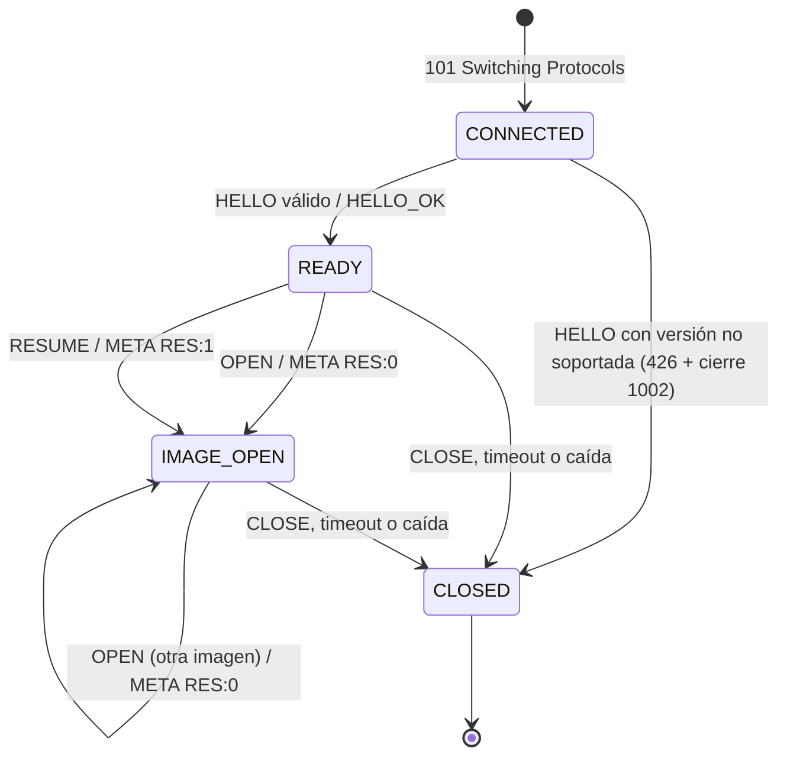

# PIMG — Protocol Image · Especificación

**Proyecto:** Servidor Asíncrono de Imágenes de Ultra Alta Resolución — Ciencias de la Computación VIII
**Autores:** Marcos Masaya, Samuel Caal
**Versión del protocolo:** 2 (`pimg.v2`) · **Documento:** v2.0 · **Fecha:** 2 de octubre de 2026
**Stack:** Java 21 sin dependencias externas (servidor) · HTML/CSS/JS con módulos ES (cliente)

> Este documento es el **contrato** entre servidor y cliente y la **fuente de verdad** del proyecto.
> Un cambio de formato se hace primero aquí y luego en el código (`src/pimg/` y `web/js/`).
> Las palabras **DEBE**, **NO DEBE** y **PUEDE** se usan en el sentido de RFC 2119.
>
> **Estado de cada parte:** ✅ implementado y probado (v1) · 🔁 implementado en v1, cambia en v2 · 📝 diseño aprobado, no implementado.

---

## Índice

0. Qué cambió de v1 a v2 (y por qué)
1. Objetivo y contexto de evaluación
2. Terminología
3. Pila de protocolos
4. Establecimiento de la conexión
5. Modelo de coordenadas (pirámide)
6. Vista (viewport)
7. Mensajes de control (texto)
8. Mensajes binarios
9. Máquina de estados de la sesión
10. Arquitectura del envío: cómo encajan los cuatro mecanismos
11. Mecanismo 1 — FEC con paridad XOR entrelazada
12. Mecanismo 2 — Control del ritmo con controlador PI
13. Mecanismo 3 — Sincronización de caché con filtros de Bloom
14. Mecanismo 4 — Planificación por plazos (EDF)
15. Recuperación de una pérdida: el camino completo
16. Red simulada
17. Cachés
18. Comportamiento del cliente
19. Heartbeat y cierre
20. Códigos de error
21. Límites y parámetros
22. Ingesta y almacenamiento
23. Decisiones de diseño
24. Preguntas previsibles en la defensa
25. Resultados medidos y experimentos pendientes
26. Estado de implementación
27. Referencias
28. Historial

---

## 0. Qué cambió de v1 a v2 (y por qué)

**v1** (implementada y probada) decide **qué** tiles enviar: el cliente informa su vista, el servidor envía los tiles visibles del centro hacia afuera, recuerda lo que ya envió y cancela lo pendiente de vistas abandonadas.

**v2** agrega **cómo** se controla y se recupera la transmisión. El ingeniero aprobó cuatro mecanismos, que son el núcleo del 60 % "protocolo" de la evaluación:

| # | Mecanismo | Pregunta que responde |
|---|---|---|
| 1 | **FEC con paridad XOR entrelazada** (RFC 5109) | ¿Cómo recupero un tile perdido o corrupto **sin pedirlo de nuevo**? |
| 2 | **Controlador PI** sobre la ocupación del búfer de recepción (RFC 3550, PIE RFC 8033) | ¿A qué **ritmo** envío para no saturar al cliente ni a la red? |
| 3 | **Filtros de Bloom** para el estado de caché del cliente (Fan et al., 2000) | ¿Cómo sabe el servidor **qué tiene el cliente** sin listas enormes, incluso tras reconectar? |
| 4 | **Planificación por plazos, EDF** (Liu y Layland, 1973) | ¿En qué **orden** envío para que lo importante llegue primero? |

### 0.1 Se agrega

| Elemento | Dónde | Por qué |
|---|---|---|
| Subprotocolo `pimg.v2`, `HELLO V:2` | §4, §7 | Distinguir clientes v1 y v2 |
| Campo `NUM` en todo mensaje binario (cabecera de 24 → 28 bytes) | §8.1 | Número de secuencia de envío, como el de RTP (RFC 3550): permite medir pérdidas, fechar el filtro de Bloom y calcular la ocupación del búfer |
| Mensaje binario **`PARIDAD`** (`TIPO = 0x02`) | §8.2, §11 | Lleva la paridad XOR de un grupo de tiles y los datos para reconstruir cualquiera de ellos |
| Mensaje **`REPORT`** (C→S, cada 100 ms) | §7, §12 | Reporte de receptor al estilo RTCP: la medición que usa el controlador PI |
| Mensaje **`CTRL`** (S→C) | §7, §12 | El servidor publica la tasa y el error del controlador para graficarlos en el panel |
| Mensaje **`BLOOM`** (C→S) | §7, §13 | El cliente envía el resumen compacto de su caché |
| **`RESUME`** con filtro de Bloom | §7, §13.6 | Reanudar una sesión tras reconectar sin reenviar lo que el cliente conserva |
| Mensaje **`SIM`** (C→S) y red simulada | §7, §16 | Sobre TCP en localhost no hay pérdidas ni congestión: sin simulación, FEC y PI no se pueden demostrar |
| Cola de envío **por plazos** (cola de prioridad) | §14 | Reemplaza la cola FIFO ordenada por distancia |
| **Re-declaración de vista** | §15 | Camino de recuperación cuando FEC no alcanza, sin pedir tiles específicos |
| Paquete `src/pimg/transporte/` y `web/js/transporte/` | §10.3 | Los mecanismos como lógica pura, probable por separado |

### 0.2 Se quita

| Elemento | Estaba en | Por qué se quita |
|---|---|---|
| Diseño v2 anterior: `TSN`, `ACK` acumulativo, `SACK`, ventana `cwnd`, Slow Start, AIMD, RTO (RFC 6298), `FWD`, recuperación parcial por relevancia, control de flujo por créditos | §17 de v1.0 (solo diseño) | El ingeniero indicó que esos mecanismos ya estaban **tomados por otros grupos**. Además, sobre TCP un segundo sistema de confirmaciones y retransmisiones duplica lo que TCP ya hace |
| Comando **`GET_TILE`** | §7 de v1 | Era una petición explícita de retransmisión de un tile (equivale a un NACK). En v2 la recuperación es por FEC (§11) o por re-declaración de vista (§15) |
| Comando **`EVICT`** | §7 de v1 | Reemplazado por `BLOOM`: en vez de una lista de claves expulsadas (~3 KB para 300 tiles), un resumen de tamaño fijo (512 B) |
| **Registro exacto de enviados** como única fuente de verdad | §7.3 de v1 | Reemplazado por: filtro de Bloom del cliente + lista de lo enviado después de la última instantánea (§13.4) |

### 0.3 Se mantiene sin cambios

Pila HTTP/WebSocket propia (§3–4), pirámide y coordenadas (§5), cálculo de la vista (§6), cancelación por `SEQ` (§7.3), CRC32 extremo a extremo (§8), máquina de estados (§9, más `RESUME`), heartbeat (§19), ingesta (§22).

---

## 1. Objetivo y contexto de evaluación

PIMG permite que un navegador explore imágenes de decenas de gigabytes **recibiendo solo los tiles que necesita para su vista actual**. El servidor mantiene, por cada cliente, el estado de lo que está viendo y de lo que ya tiene, y decide qué enviar, en qué orden, a qué ritmo y cómo recuperar lo que se pierde.

### 1.1 Requisitos que condicionan el diseño

- Servidor Java 20/21 que atiende **múltiples clientes** con un **protocolo propio** para controlar la resolución de cada cliente.
- HTTP **solo** para los archivos iniciales; la imagen viaja por el protocolo propio.
- Ninguna petición externa; toda librería del frontend alojada en el servidor. Se califica **sin internet**.
- La imagen **nunca** se envía completa en máxima calidad. El cliente **gestiona su memoria**.
- **No es una galería ni un simple zoom.** Niveles, versiones o coordenadas son **la base y no puntúan**.
- Evaluación: **40 % funcionamiento y usabilidad, 60 % protocolo.** El protocolo debe gestionar la transmisión eficientemente y **no dejar al usuario desatendido**, incluso en la máxima definición.
- El protocolo debe usar o **adaptar** mecanismos de control y recuperación.
- Se valida con las herramientas del navegador (DevTools).
- Imágenes de evaluación: 17, 28, 55 y 93 GB (punteo máximo 20, 40, 80 y 115). Son **números con dígitos de 3×5 px** que deben **leerse claramente** en la máxima definición.
- El documento debe explicar campos, estructuras, algoritmos y mecanismos de control (referencia: RFC 9293).

### 1.2 Idea central

La transmisión se trata como un **problema de transporte en unidades de tile**, con cuatro responsabilidades separadas:

| Responsabilidad | Mecanismo |
|---|---|
| **Qué** enviar | Vista (§6) menos lo que el cliente ya tiene según su filtro de Bloom (§13) |
| **En qué orden** | Plazos según la prioridad visual (EDF, §14) |
| **A qué ritmo** | Controlador PI sobre la ocupación del búfer de recepción (§12) |
| **Cómo recuperar** | Paridad XOR (§11) y re-declaración de vista (§15) |

**Analogía de base de datos:** cada tile es un registro con clave primaria `(z, x, y)`; la aritmética del quadtree es el índice; las cachés son el *buffer pool*; y el filtro de Bloom cumple el mismo papel que en Cassandra o Bigtable: evitar trabajo para datos que el otro lado ya tiene.

---

## 2. Terminología

| Término | Definición |
|---|---|
| **Tile** | Bloque de hasta `T × T` píxeles (`T = 256`) de un nivel de la pirámide |
| **Nivel `z`** | Una versión completa de la imagen a cierta resolución. `z = 0` es la menor |
| **Vista (viewport)** | Rectángulo que el cliente muestra, en píxeles del nivel `z` |
| **Sesión** | Estado que el servidor guarda por conexión (§10.2) |
| **`SEQ`** | Número de secuencia **de vista**, generado por el cliente, estrictamente creciente por conexión |
| **`NUM`** | 🆕 Número de secuencia **de envío** de cada mensaje binario, generado por el servidor, creciente por conexión. Como el número de secuencia de RTP: sirve para medir, **no** para confirmar ni retransmitir |
| **Grupo FEC** | 🆕 Conjunto de 2 a 4 tiles protegidos por una misma paridad |
| **Paridad** | 🆕 XOR byte a byte de los tiles de un grupo (§11) |
| **Ocupación `Q`** | 🆕 Tiles enviados por el servidor que el cliente todavía no ha procesado (en la red + en cola de decodificación) |
| **Tasa `R`** | 🆕 Mensajes binarios por segundo que el servidor puede enviar, fijada por el controlador PI |
| **Filtro de Bloom** | 🆕 Arreglo de bits que resume qué tiles tiene el cliente (§13) |
| **Instantánea** | 🆕 Un filtro de Bloom junto con el `NUM` más alto recibido cuando se construyó (`MAX`) |
| **Plazo** | 🆕 Momento límite en que un tile debería enviarse, según su prioridad visual (§14) |
| **Pedido** | Entrada de la cola de envío: un tile, una paridad o la marca `DONE`. **Solo coordenadas, no bytes** |

---

## 3. Pila de protocolos ✅

```
┌───────────────────────────────┐
│ PIMG v2 (este documento)      │  Qué, en qué orden, a qué ritmo y cómo recuperar
├───────────────────────────────┤
│ WebSocket (RFC 6455)          │  Delimitación de mensajes; texto (control) vs binario (tiles y paridades)
├───────────────────────────────┤
│ HTTP/1.1 (RFC 9112)           │  Archivos iniciales + handshake de Upgrade
├───────────────────────────────┤
│ TCP (RFC 9293)                │  Entrega confiable y ordenada de bytes
└───────────────────────────────┘
```

HTTP y WebSocket están **implementados a mano** sobre `java.net.Socket`, sin librerías.

| Problema | Responsable |
|---|---|
| Pérdida, desorden y duplicación de bytes en la red | TCP |
| Límites entre mensajes; texto vs binario | WebSocket |
| Detección de conexión muerta | WebSocket PING/PONG (período definido por PIMG) |
| Qué tile contiene cada mensaje; integridad disco → pantalla | PIMG: cabecera + CRC32 |
| Cancelar trabajo de vistas abandonadas | PIMG: `SEQ` |
| Qué tiene cada cliente | PIMG: filtro de Bloom (§13) |
| Orden de envío | PIMG: EDF (§14) |
| Ritmo de envío | PIMG: controlador PI (§12) |
| Recuperación de tiles perdidos o corruptos | PIMG: FEC (§11) + re-declaración (§15) |

**¿Por qué hay pérdidas si TCP es confiable?** En la aplicación un tile se pierde por **corrupción** entre el disco y la pantalla (detectada por CRC32), por **reconexión** o, en la demostración, por la **red simulada** (§16), que reproduce un enlace con pérdidas. Los mecanismos de v2 están diseñados para un enlace real con pérdidas y se verifican con esa simulación.

---

## 4. Establecimiento de la conexión ✅

### 4.1 HTTP/1.1

- Solo `GET`. Otro método → `405` con `Allow: GET` y cierre.
- Archivos desde `web/`; `/` → `/index.html`. Protección contra *path traversal* (ruta normalizada dentro de `web/`, si no `404`).
- `Content-Type` por extensión; envío por streaming; `keep-alive` con 30 s de inactividad.
- El parser lee **byte por byte** para no consumir bytes de frames WebSocket que lleguen tras el handshake.

### 4.2 Upgrade a WebSocket

El cliente abre `ws://<mismo host>/ws` con subprotocolo **`pimg.v2`**. Validaciones en orden:

| Condición | Si falla |
|---|---|
| `GET`, `Upgrade` contiene `websocket`, `Connection` contiene `upgrade` | `400` |
| `Sec-WebSocket-Version: 13` | `426` con `Sec-WebSocket-Version: 13` |
| `Sec-WebSocket-Key` es Base64 de 16 bytes | `400` |
| `Sec-WebSocket-Protocol` contiene `pimg.v2` | `400` |

`Sec-WebSocket-Accept = Base64(SHA-1(clave + "258EAFA5-E914-47DA-95CA-C5AB0DC85B11"))`. Verificado con el ejemplo de RFC 6455 §1.3 (`dGhlIHNhbXBsZSBub25jZQ==` → `s3pPLMBiTxaQ9kYGzzhZRbK+xOo=`).

### 4.3 Frames (RFC 6455 §5)

- Cliente → servidor **enmascarados** (si no, `1002`). Servidor → cliente sin máscara y sin fragmentar.
- RSV activos u opcode desconocido → `1002`. Control: ≤ 125 bytes y `FIN = 1`.
- Fragmentación del cliente reensamblada; límite 16 KB → si se excede, `1009` antes de leer la carga.
- Texto no UTF-8 → `1007`. PING → PONG automático.
- Escritura protegida con `ReentrantLock` (no `synchronized`, para no fijar el hilo virtual a su portador en Java 21).

---

## 5. Modelo de coordenadas (pirámide) ✅

Imagen de `W × H` y tile `T = 256`.

```
L = 1; lado = max(W, H)
mientras lado > T:  lado = ⌈lado / 2⌉ ; L = L + 1          (aritmética entera, sin log₂ flotante)
```

- `z = 0`: imagen completa en un tile. `z = L − 1`: resolución original.
- Con `s = L − 1 − z`: `W_z = ⌈W / 2^s⌉`, `H_z = ⌈H / 2^s⌉`; columnas `C_z = ⌈W_z / T⌉`, filas `R_z = ⌈H_z / T⌉`.
- Tile `(z, x, y)` cubre `[x·T, min((x+1)·T, W_z)) × [y·T, min((y+1)·T, H_z))`. Los del borde PUEDEN ser menores que `T`.
- **Quadtree implícito:** hijos de `(z,x,y)` = `(z+1, 2x+i, 2y+j)`; ancestro `k` niveles arriba = `(z−k, x≫k, y≫k)`. O(1), sin árbol.
- Texto: `z,x,y`; lista separada por `;`. Clave interna (64 bits): `z≪56 | x≪28 | y`.

| Imagen | W × H | L | Tiles nivel máximo | Tiles totales |
|---|---|---|---|---|
| eso1242a TIFF 40K | 40 000 × 30 131 | 9 | 157 × 118 = 18 526 | 24 796 |
| eso1242a PSB | 108 199 × 81 503 | 10 | 423 × 319 = 134 937 | 180 189 |
| Evaluación 93 GB (PNG) | 176 393 × 176 393 | 11 | 690 × 690 = 476 100 | 635 214 |

Implementación: `pimg.tiles.PyramidLayout` y `visor.js`. **Ambas DEBEN dar los mismos valores.**

---

## 6. Vista (viewport) ✅

El cliente describe su vista en **píxeles del nivel `z`**: esquina `X, Y` (PUEDEN ser negativas) y tamaño `VW, VH`, con `1 ≤ VW, VH ≤ 4096` y `X, Y ≥ −4096`.

Tiles visibles (`floorDiv`):

- `x` de `max(0, ⌊X/T⌋)` a `min(C_z − 1, ⌊(X + VW − 1)/T⌋)`
- `y` de `max(0, ⌊Y/T⌋)` a `min(R_z − 1, ⌊(Y + VH − 1)/T⌋)`

**Distancia de un tile a la vista** (usada por EDF, §14), en unidades de tile:

```
dist(t) = √[ ((x + 0.5)·T − (X + VW/2))² + ((y + 0.5)·T − (Y + VH/2))² ] / T
```

Implementación: `pimg.protocol.Vista`.

---

## 7. Mensajes de control (texto)

Frames de texto (opcode `0x1`), UTF-8.

### 7.1 Sintaxis ✅

```
MENSAJE = COMANDO *( "|" CAMPO )
CAMPO   = CLAVE ":" VALOR
COMANDO = 1*( "A"-"Z" / "_" )
CLAVE   = 1*( "A"-"Z" / "_" )
VALOR   = *( cualquier carácter excepto "|" )
```

El valor empieza tras el **primer** `:`. Clave repetida → `400`. Orden libre. Máximo 16 KB. Identificadores de imagen `[A-Za-z0-9_-]{1,64}`. Números enteros decimales; fuera de rango → `400`. El servidor reemplaza `|` por `/` en los valores que genera.

### 7.2 Catálogo

| Comando | Dir. | Campos | Estado requerido | Respuesta | Estado |
|---|---|---|---|---|---|
| `HELLO` | C→S | `V` (=2), `CACHE` (1–1 000 000) | `CONNECTED` | `HELLO_OK` o `ERROR` | ✅ |
| `HELLO_OK` | S→C | `V`, `HB` (s), `TS` (px), `BM` (bits del filtro), `BK` (hashes), `RPT` (ms entre reportes) | — | — | ✅ |
| `LIST` | C→S | — | `READY`, `IMAGE_OPEN` | `LIST_RESP` | ✅ |
| `LIST_RESP` | S→C | `IMGS` = `id,ESTADO,PROGRESO;…` | — | — | 🟨 solo `READY,100` |
| `OPEN` | C→S | `IMG` | `READY`, `IMAGE_OPEN` | `META` o `ERROR` | ✅ |
| `RESUME` | C→S | `IMG`, `SEM`, `BITS` | `READY` | `META` o `ERROR` | ✅ |
| `META` | S→C | `IMG`, `W`, `H`, `TS`, `L`, `FMT`, `RES` (0 = nueva, 1 = reanudada) | — | — | ✅ |
| `VIEWPORT` | C→S | `SEQ`, `Z`, `X`, `Y`, `VW`, `VH` | `IMAGE_OPEN` | tiles, paridades y `DONE` | ✅ |
| `BLOOM` | C→S | `MAX`, `SEM`, `BITS` | `IMAGE_OPEN` | ninguna | ✅ |
| `REPORT` | C→S | `MAX`, `PERD`, `COLA`, `DEC`, `JIT`, `REC` | `IMAGE_OPEN` | `CTRL` | ✅ |
| `CTRL` | S→C | `R`, `Q`, `E`, `TARDE` | — | — | ✅ |
| `CANCEL` | C→S | `SEQ` | `IMAGE_OPEN` | ninguna | ✅ |
| `SIM` | C→S | `PERD`, `BW`, `LAT` | `READY`, `IMAGE_OPEN` | `SIM_OK` o `ERROR 403` | ✅ |
| `SIM_OK` | S→C | `PERD`, `BW`, `LAT` (valores aplicados) | — | — | ✅ |
| `DONE` | S→C | `SEQ`, `SENT`, `PAR` | — | — | ✅ |
| `ERROR` | S→C | `CODE`, `MSG` | — | — | ✅ |
| ~~`GET_TILE`~~ | — | **Eliminado en v2** (§0.2) | — | — | ❌ |
| ~~`EVICT`~~ | — | **Eliminado en v2**, reemplazado por `BLOOM` | — | — | ❌ |

**Rangos:** `SEQ`, `MAX`, `PERD`, `REC` ∈ [0, 2³²−1] · `Z` ∈ [0, 255] y `< L` (si no `416`) · `X, Y` ∈ [−4096, 2³¹−1] · `VW, VH` ∈ [1, 4096] · `SEM` ∈ [0, 2³²−1] · `COLA` ∈ [0, 10 000] · `DEC`, `JIT` ∈ [0, 60 000] ms · `PERD` de `SIM` ∈ [0, 50] % · `BW` ∈ [0, 1 000 000] KB/s (0 = sin límite) · `LAT` ∈ [0, 2000] ms. `BITS` DEBE ser Base64 (RFC 4648) de exactamente `BM / 8` bytes; si no, `400`.

### 7.3 Semántica

**`HELLO`** — Negocia versión. `V ≠ 2` → `ERROR|CODE:426` y cierre `1002`. `HELLO_OK` informa los parámetros que el cliente DEBE usar: `BM:4096|BK:7|RPT:100`.

**`LIST`** — El servidor relee el catálogo en cada `LIST`. Una imagen está `READY` si existe su `meta.json`.

**`OPEN`** — Abre una imagen. El servidor DEBE vaciar la cola, vaciar el filtro del cliente y la lista de enviados recientes (§13.4), y responder `META|…|RES:0`. El cliente DEBE vaciar su caché. `SEQ` y `NUM` **no** se reinician.

**`RESUME`** — Como `OPEN`, pero el cliente conserva su caché y envía su filtro. El servidor inicializa el filtro con `BITS` y `SEM` y responde `META|…|RES:1` (§13.6).

**`VIEWPORT`** — Mensaje principal. El servidor:

1. Si `SEQ ≤ SEQ vigente` → **ignora el mensaje**.
2. Valida rangos (`Z ≥ L` → `416`).
3. Calcula los tiles visibles (§6).
4. **Filtra** los que el cliente ya tiene según `tiene(t)` (§13.4).
5. Actualiza el `SEQ` vigente y **vacía la cola**: cancela todo lo pendiente de vistas anteriores, incluidas sus paridades y su `DONE`.
6. **Asigna plazos** (§14) y arma los **grupos FEC** (§11) con los tiles de mayor prioridad.
7. Encola tiles y paridades en la cola por plazos, hasta `COLA_MAX − 1`, y una marca `DONE` con plazo infinito.

Al llegar a la marca, el emisor envía `DONE|SEQ:n|SENT:k|PAR:p` (`k` tiles y `p` paridades efectivamente enviados). Si llegó una vista nueva antes, la marca ya no existe y **no hay `DONE` para la vista vieja**.

**`BLOOM`** — El cliente envía una instantánea de su caché (§13). El servidor reemplaza el filtro y descarta de la lista de enviados recientes todo lo que tenga `NUM ≤ MAX`.

**`REPORT`** — Reporte de receptor (§12.2). El servidor actualiza el controlador PI y responde `CTRL`.

**`CANCEL`** — Descarta de la cola todos los pedidos con `SEQ ≤` el indicado.

**`SIM`** — Configura la red simulada (§16). Solo se acepta si el servidor se inició con `--sim`; si no, `ERROR|CODE:403`.

---

## 8. Mensajes binarios

Frames binarios (opcode `0x2`), **solo servidor → cliente**. Enteros **big-endian, sin signo**. El cliente que envía un binario recibe cierre `1003`.

Todo mensaje binario empieza con la misma **cabecera común de 10 bytes**:

| Offset | Tamaño | Campo | Descripción |
|---|---|---|---|
| 0 | 1 | `VER` | Versión = **2** |
| 1 | 1 | `TIPO` | `0x01` = TILE, `0x02` = PARIDAD (otros reservados) |
| 2 | 4 | `SEQ` | `SEQ` de la vista que originó el envío |
| 6 | 4 | `NUM` | 🆕 Número de secuencia de envío (§8.3) |

### 8.1 TILE (`TIPO = 0x01`) — 28 bytes + datos ✅

```
 0     1     2           6           10    11          15          19    20          24          28
 ┌─────┬─────┬───────────┬───────────┬─────┬───────────┬───────────┬─────┬───────────┬───────────┬──────────
 │ VER │TIPO │ SEQ       │ NUM       │  Z  │ X         │ Y         │ FMT │ LONGITUD  │ CRC32     │ DATOS …
 │ 1 B │ 1 B │ 4 B       │ 4 B       │ 1 B │ 4 B       │ 4 B       │ 1 B │ 4 B       │ 4 B       │
 └─────┴─────┴───────────┴───────────┴─────┴───────────┴───────────┴─────┴───────────┴───────────┴──────────
```

| Offset | Tamaño | Campo | Descripción |
|---|---|---|---|
| 0–9 | 10 | Cabecera común | `VER = 2`, `TIPO = 0x01`, `SEQ`, `NUM` |
| 10 | 1 | `Z` | Nivel |
| 11 | 4 | `X` | Columna |
| 15 | 4 | `Y` | Fila |
| 19 | 1 | `FMT` | `1` = JPEG, `2` = PNG |
| 20 | 4 | `LONGITUD` | Bytes de `DATOS` |
| 24 | 4 | `CRC32` | CRC-32 ISO-HDLC (polinomio `0xEDB88320` = `java.util.zip.CRC32`) de `DATOS` |
| 28 | `LONGITUD` | `DATOS` | Imagen codificada del tile |

**Cambio respecto a v1:** se insertó `NUM` en los bytes 6–9, así que todo lo demás se corre 4 bytes (cabecera de 24 → 28).

### 8.2 PARIDAD (`TIPO = 0x02`) — 19 + 18·K bytes + datos ✅

```
 Cabecera común (10 B) │ K (1 B) │ K entradas de 18 B │ LONG_P (4 B) │ CRC_P (4 B) │ DATOS_P (LONG_P B)
```

| Offset | Tamaño | Campo | Descripción |
|---|---|---|---|
| 0–9 | 10 | Cabecera común | `VER = 2`, `TIPO = 0x02`, `SEQ`, `NUM` |
| 10 | 1 | `K` | Número de tiles del grupo, 2 ≤ K ≤ 4 |
| 11 + 18·i | 1 | `Z_i` | Nivel del tile `i` del grupo |
| 12 + 18·i | 4 | `X_i` | Columna |
| 16 + 18·i | 4 | `Y_i` | Fila |
| 20 + 18·i | 1 | `FMT_i` | Formato |
| 21 + 18·i | 4 | `LONG_i` | Longitud de los datos del tile `i` |
| 25 + 18·i | 4 | `CRC_i` | CRC32 de los datos del tile `i` |
| 11 + 18·K | 4 | `LONG_P` | Longitud de la paridad = `max(LONG_i)` |
| 15 + 18·K | 4 | `CRC_P` | CRC32 de `DATOS_P` |
| 19 + 18·K | `LONG_P` | `DATOS_P` | XOR de los datos de los K tiles, cada uno rellenado con ceros hasta `LONG_P` |

Con K = 4 la cabecera mide 91 bytes. Las entradas por tile existen porque la paridad sola no alcanza para reconstruir: el receptor necesita saber **qué** tiles cubre, **cuánto** medía el faltante (para quitar el relleno) y su **CRC** (para verificar que la reconstrucción es correcta).

### 8.3 `NUM`: número de secuencia de envío ✅

- El servidor asigna `NUM = 1, 2, 3…` a cada mensaje binario de la conexión, **en el orden en que salen del emisor**, incluidos los que la red simulada descarta.
- Como TCP entrega en orden, el cliente los recibe crecientes. Un salto (`NUM` recibido > último + 1) significa que la red simulada descartó mensajes: el cliente suma la diferencia a su contador `PERD`.
- `NUM` **no** se usa para confirmar ni para pedir retransmisiones: igual que el número de secuencia de RTP (RFC 3550), solo permite **medir** (pérdidas y ocupación, §12) y **fechar** las instantáneas del filtro (§13.4).

### 8.4 Validaciones del receptor

Si alguna falla, el mensaje se descarta (y cuenta como pérdida para FEC):
- `VER = 2`, `TIPO` y `FMT` conocidos; longitudes coherentes con el tamaño del mensaje.
- `SEQ ≥ seqInicioImagen` (el `SEQ` siguiente al último `OPEN`/`RESUME`). Uno menor pertenece a una imagen anterior.
- `CRC32` calculado = campo `CRC32` (TILE) o `CRC_P` (PARIDAD).

**Justificación del CRC32:** TCP protege solo el tramo de red y con un checksum de 16 bits. El CRC32 cubre el recorrido completo disco → servidor → red → cliente (argumento *end-to-end*, Saltzer, Reed y Clark, 1984; Stone y Partridge, 2000). En v2, además, **un tile con CRC incorrecto se trata como perdido** y entra al mismo camino de recuperación.

---

## 9. Máquina de estados de la sesión ✅


```mermaid
stateDiagram-v2
    [*] --> CONNECTED: 101 Switching Protocols
    CONNECTED --> READY: HELLO válido / HELLO_OK
    CONNECTED --> CLOSED: HELLO con versión no soportada (426 + cierre 1002)
    READY --> IMAGE_OPEN: OPEN / META RES:0
    READY --> IMAGE_OPEN: RESUME / META RES:1
    IMAGE_OPEN --> IMAGE_OPEN: OPEN (otra imagen) / META RES:0
    READY --> CLOSED: CLOSE, timeout o caída
    IMAGE_OPEN --> CLOSED: CLOSE, timeout o caída
    CLOSED --> [*]
```

Comando en estado no permitido → `ERROR|CODE:412` **sin cerrar**. Al cerrar, el servidor descarta toda la sesión: la continuidad entre conexiones la aporta el cliente con `RESUME`.

---

## 10. Arquitectura del envío: cómo encajan los cuatro mecanismos

### 10.1 Tubería de envío ✅

```
                    ┌──────────────────────────────────────────────────────────────────────────────┐
 VIEWPORT seq=7 ──► │ [3] FILTRO DE ESTADO   quita los tiles que el cliente ya tiene (Bloom)       │
                    │ [4] PLANIFICADOR EDF   asigna plazos por prioridad visual y ordena           │
                    │ [1] FEC                arma grupos entrelazados con los más prioritarios     │
                    │                         y agrega una PARIDAD por grupo a la cola             │
                    └──────────────────────────────┬───────────────────────────────────────────────┘
                                                   ▼ cola por plazos (solo coordenadas)
                    ┌──────────────────────────────────────────────────────────────────────────────┐
                    │ EMISOR: toma el pedido de plazo más próximo                                  │
                    │   TILE    → caché/disco → asigna NUM → mensaje TILE                          │
                    │   PARIDAD → XOR de los datos de sus miembros → asigna NUM → mensaje PARIDAD  │
                    │   DONE    → DONE|SEQ|SENT|PAR                                                │
                    │ [2] REGULADOR PI: espera 1/R segundos entre mensajes binarios                │
                    └──────────────────────────────┬───────────────────────────────────────────────┘
                                                   ▼
                              ENLACE: directo al socket, o red simulada (§16)
 REPORT  ──► [2] actualiza R          BLOOM ──► [3] actualiza el filtro
```

Cada mecanismo responde una sola pregunta y no conoce a los demás: el filtro decide **qué**, EDF **cuándo**, FEC **cómo proteger**, PI **qué tan rápido**. `SesionPimg` solo los orquesta.

### 10.2 Estado por sesión en el servidor

| Estado | Contenido | Tamaño típico |
|---|---|---|
| Imagen abierta, `SEQ` vigente | Identificador y número | Bytes |
| Contador `NUM` | Último número asignado | 4 B |
| Filtro del cliente | 4096 bits + `SEM` + `MAX` | 512 B |
| Enviados recientes | `(NUM, clave)` enviados después de la última instantánea | Decenas de entradas |
| Cola por plazos | Pedidos de la vista vigente (≤ 300) | ~10 KB |
| Controlador PI | `R`, integral, último reporte | Bytes |

### 10.3 Ubicación en el código

```
src/pimg/
├── transporte/              ✅ lógica pura, sin sockets ni archivos (probable por separado)
│   ├── FecXor.java           armado de grupos entrelazados y cálculo de la paridad ✅
│   ├── ControladorPI.java    tasa R a partir de los reportes ✅
│   ├── FiltroBloom.java      estructura y hashes (idénticos a los de JS, §13.3) ✅
│   ├── PlanificadorEDF.java  cola por plazos ✅
│   └── RedSimulada.java      pérdida, ancho de banda y latencia artificiales ✅
└── protocol/SesionPimg.java  orquesta: usa transporte/, tiles/ y websocket/
    protocol/Enlace.java       ✅ hilo y cola FIFO de 4 MB que aplican la red simulada sobre el socket
web/js/transporte/            ✅ fec.js, bloom.js, reportes.js
```

Dependencias: `protocol → transporte`; `transporte` no depende de nada del proyecto.

### 10.4 Hilos

Por conexión: un hilo virtual **lector** (atiende los mensajes del cliente), uno **emisor** (cola EDF + pacing PI), uno de **heartbeat** y, solo con red simulada, uno de **enlace**. Hilos virtuales sin pool (JEP 444). La cola se protege con `ReentrantLock` + `Condition`.

---

## 11. Mecanismo 1 — FEC con paridad XOR entrelazada ✅

### 11.1 Problema

Con retransmisión, recuperar un tile cuesta **al menos una ida y vuelta** (detectar la falta, avisar, esperar el reenvío). Los tiles del centro de la vista son los que el usuario espera ver primero: perderlos lo deja "desatendido". FEC (*Forward Error Correction*) envía redundancia **por adelantado** para reconstruir sin pedir nada.

### 11.2 Cómo funciona la paridad XOR

El XOR (`⊕`) cumple `a ⊕ a = 0` y `a ⊕ 0 = a`. Si la paridad es `P = A ⊕ B ⊕ C ⊕ D` y se pierde `C`:

```
P ⊕ A ⊕ B ⊕ D = (A ⊕ B ⊕ C ⊕ D) ⊕ A ⊕ B ⊕ D = C
```

Los tiles miden distinto, así que cada uno se rellena con ceros hasta `LONG_P = max(LONG_i)` antes del XOR. Al reconstruir, el resultado se recorta a `LONG_i` del faltante y se verifica con `CRC_i`.

### 11.3 Qué se protege y cómo se agrupa (entrelazado)

1. Tras filtrar y ordenar por plazo (§14), se toman los **`N = min(16, nuevos)`** tiles de mayor prioridad: los más cercanos al centro.
2. Número de grupos: `G = ⌈N / 4⌉`.
3. El tile de rango `i` (0 = el más prioritario) va al grupo **`i mod G`**.
4. Grupos con menos de 2 tiles no se protegen (una paridad de un solo tile sería una copia).

Con N = 16 y G = 4:

```
rango:   0  1  2  3 | 4  5  6  7 | 8  9 10 11 | 12 13 14 15
grupo:   0  1  2  3 | 0  1  2  3 | 0  1  2  3 |  0  1  2  3
```

**Por qué entrelazar:** los tiles con rango consecutivo se envían seguidos y además están cerca en la imagen. Una **ráfaga** de pérdidas (varios mensajes seguidos) afecta a lo sumo **un tile por grupo** si dura ≤ G mensajes, y cada grupo puede recuperar uno. Sin entrelazar (grupo 0 = rangos 0–3), una ráfaga de 2 destruiría el grupo completo. Además, los miembros de un grupo quedan a distintas distancias del centro: **separados en la imagen**, como se acordó.

**Ejemplo:** se pierden los rangos 5, 6 y 7 seguidos → grupos 1, 2 y 3 pierden uno cada uno → **los tres se reconstruyen**.

### 11.4 Envío

- Cada `PARIDAD` recibe plazo = `max(plazo de sus miembros) + 1 ms`, así EDF la envía **justo después de su último miembro** (con N = 16: después de los rangos 12, 13, 14 y 15).
- El emisor calcula el XOR **al momento de enviarla**, leyendo los datos de los miembros desde la caché del servidor (acaban de enviarse, así que están en RAM).
- Si un miembro no pudo leerse del disco, se excluye de la paridad (`K` se reduce); si quedan menos de 2, la paridad no se envía.

### 11.5 Recuperación en el cliente

El cliente DEBE conservar los datos crudos de al menos los **últimos 32 tiles** recibidos de la vista vigente, hasta procesar las paridades. Al recibir una `PARIDAD`:

```
faltantes = miembros que no llegaron o llegaron con CRC incorrecto
si faltantes = 0:   descartar la paridad (no hizo falta)
si faltantes = 1:   C = DATOS_P ⊕ (datos de los demás miembros, rellenados a LONG_P)
                    recortar C a LONG_C; si CRC32(C) = CRC_C → entregar como tile normal, REC++
si faltantes ≥ 2:   no recuperable por FEC → camino de §15
```

### 11.6 Costo

| Medida | Valor |
|---|---|
| Extra sobre los tiles protegidos | 1 paridad por cada 4 tiles ≈ **25 %** (más el relleno si los tamaños difieren) |
| Extra sobre una vista de ~40 tiles con 16 protegidos | 4 paridades ≈ **10 %** |
| Pérdidas recuperables | 1 por grupo; ráfagas de hasta G = 4 mensajes |
| Retardo para recuperar | Hasta que llega la paridad: a lo sumo 4 mensajes después del tile perdido, sin ida y vuelta |

**Medido.** `ProbarFec`: 16 tiles de 20–40 KB generan 156 736 bytes de paridad sobre 515 818 protegidos = **30.4 %**. Es el 25 % teórico más el relleno con ceros cuando los miembros miden distinto. En el navegador, con 5 % de pérdida simulada sobre la imagen de 1 GB: 2 mensajes perdidos, **2 recuperados por FEC**, 0 irrecuperables. Las cuentas cuadran: `NUM` = tiles + paridades + perdidos (178 + 25 + 2 = 205).

### 11.7 Ventajas, desventajas y mitigación

| Ventajas | Desventajas | Mitigación |
|---|---|---|
| Recupera sin esperar una ida y vuelta | Datos extra (~10 % por vista) | Solo se protegen los 16 tiles más prioritarios |
| No necesita retroalimentación del cliente | XOR recupera solo 1 pérdida por grupo | Grupos pequeños y entrelazados; respaldo de §15 |
| Resiste ráfagas cortas | Si se pierde la paridad junto con un miembro, ese grupo no se recupera | El respaldo de §15 cubre ese caso |
| Muy simple de implementar | Sobre TCP en localhost no hay pérdidas: el beneficio solo se ve con corrupción o red simulada | Se demuestra con pérdida simulada (§16); en producción sería útil en enlaces con pérdidas |

**Referencia:** RFC 5109 (*RTP Payload Format for Generic Forward Error Correction*), que define la protección de paquetes RTP con paridad XOR.

---

## 12. Mecanismo 2 — Control del ritmo con controlador PI ✅

### 12.1 Problema

Sin control de ritmo, el servidor escribe en el socket tan rápido como puede. Si el cliente decodifica lento o el enlace es angosto, los tiles se **acumulan** en buffers: el usuario espera más y, cuando cambia de vista, esos tiles ya obsoletos siguen llegando porque ya salieron del servidor. El objetivo es mantener **pocos tiles "en camino"**: los suficientes para no dejar al cliente sin trabajo, y no tantos como para que la cancelación pierda efecto.

### 12.2 Medición: `REPORT` (reporte de receptor)

Cada `RPT = 100 ms` el cliente envía, al estilo de los *receiver reports* de RTCP (RFC 3550 §6.4):

```
REPORT|MAX:<n>|PERD:<n>|COLA:<n>|DEC:<ms>|JIT:<ms>|REC:<n>
```

| Campo | Significado | Análogo en RTCP |
|---|---|---|
| `MAX` | `NUM` más alto recibido | *extended highest sequence number received* |
| `PERD` | Mensajes perdidos acumulados (saltos en `NUM`) | *cumulative number of packets lost* |
| `COLA` | Tiles recibidos que esperan decodificarse | — (propio) |
| `DEC` | Tiempo promedio de decodificación de un tile (ms) | — (propio) |
| `JIT` | Variación entre llegadas: `J ← J + (│Δₖ − Δₖ₋₁│ − J) / 16`, con Δ = tiempo entre llegadas consecutivas | *interarrival jitter* (fórmula de §6.4.1 adaptada) |
| `REC` | Tiles reconstruidos por FEC (acumulado) | — (propio) |

**El reporte no es un ACK:** no confirma tiles concretos, no libera ninguna ventana y nunca provoca una retransmisión. Es una **medición** del estado del receptor, igual que en RTCP.

### 12.3 Variable controlada: ocupación `Q`

```
Q = (NUM del último mensaje enviado − MAX)  +  COLA
     └──── en la red / en buffers ────┘      └─ esperando decodificar ─┘
```

`Q` cuenta los tiles que el servidor ya soltó y el usuario todavía no ve. **Objetivo `Q* = 8 tiles`**: suficiente para que el cliente siempre tenga algo que decodificar, y poco para que una vista abandonada desperdicie a lo sumo ~8 tiles.

### 12.4 Ley de control (discreta, Δt = 0.1 s)

```
eₖ = Q* − Qₖ                                    error: positivo = hay espacio, negativo = sobra
Iₖ = Iₖ₋₁ + eₖ · Δt                             término integral (con anti-windup, abajo)
Rₖ = clamp( R₀ + Kp · eₖ + Ki · Iₖ ,  R_min, R_max )
```

| Parámetro | Valor inicial | Significado |
|---|---|---|
| `R₀` | 40 mensajes/s | Tasa base |
| `Kp` | 4 (mensajes/s por tile de error) | Ganancia proporcional: reacciona al error actual |
| `Ki` | 8 (mensajes/s por tile·s) | Ganancia integral: elimina el error que persiste |
| `R_min`, `R_max` | 4 y 400 mensajes/s | Límites de seguridad |
| `Q*` | 8 tiles | Punto de operación |

Los valores de `Kp` y `Ki` son **iniciales**; se ajustan con la red simulada midiendo sobrepico y tiempo de establecimiento (§25).

**Por qué cada término:**
- **P** reacciona rápido: si `Q` sube a 20, `e = −12` y la tasa baja `4 · 12 = 48` mensajes/s de inmediato.
- **I** corrige el error que P solo no elimina: con solo P, el sistema se estabiliza con un error constante; la integral sigue acumulando hasta que `Q` vuelve exactamente a `Q*`.
- **Sin D** (derivativo): `Q` se mide cada 100 ms con ruido (ráfagas de llegada); la derivada amplificaría ese ruido.

### 12.5 Anti-windup (saturación del integrador)

Si `R` está en su límite y el error empuja más allá de ese límite, **la integral no se actualiza** (integración condicional):

```
si (R = R_max y eₖ > 0) o (R = R_min y eₖ < 0):  Iₖ = Iₖ₋₁
```

Sin esto, durante una saturación larga la integral crecería sin límite y, al desaparecer la causa, la tasa tardaría mucho en volver (sobrepico grande).

**Ejemplo:** `Q = 20`, `I = 0` → `R = 40 + 4·(−12) = −8` → se satura en `R_min = 4`. Como `e < 0` empuja hacia abajo, la integral no acumula. Cuando el cliente se pone al día y `Q = 4`, `e = +4` → `R = 40 + 16 = 56` y la integral empieza a subir la tasa ~3 mensajes/s por reporte mientras `Q` siga bajo el objetivo.

**Regla de reposo.** Tampoco se integra un error positivo si el servidor no tiene pedidos pendientes: sin demanda, `Q = 0` no significa que haya espacio que aprovechar. Sin esta regla, la integral llevaría `R` al máximo durante cualquier pausa (D-41).

### 12.6 Aplicación de la tasa (pacing)

El emisor deja al menos `1/R` segundos entre mensajes binarios. Los mensajes de texto (`DONE`, `ERROR`, `CTRL`) no se espacian.

**Protección:** si no llega ningún `REPORT` en `3 × RPT = 300 ms`, el servidor fija `R = R_min` hasta recibir el siguiente.

El emisor espera su turno **antes** de sacar el siguiente pedido de la cola EDF, así la espera cuenta para `TARDE` (§14.4) y un tile de una vista cancelada durante la espera ya no sale. Con el servidor iniciado con `--sin-pi` no hay espera y `CTRL` informa `R:0` (modo de comparación, D-41).

### 12.7 Publicación: `CTRL`

Tras cada `REPORT` el servidor responde `CTRL|R:<tasa>|Q:<ocupación>|E:<error>|TARDE:<%>`, para graficar la respuesta del controlador en el panel. `TARDE` es el porcentaje de mensajes enviados después de su plazo (§14.4).

### 12.7.1 Resultados medidos

**Simulación (`ProbarPI`)**, con el reporte retrasado 100 ms:

| Escenario | Q máximo | Se establece en | Q final |
|---|---|---|---|
| Enlace de 10 tiles/s | 20.5 | 2.0 s | 8.0 |
| Enlace de 200 tiles/s | 8.0 | 2.3 s | 8.0 |
| Escalón de 200 a 10 tiles/s | 55.9 | 7.8 s | 8.0 |
| `Kp = Ki = 10` (inestable) | 17.1 | no se establece | 15.7 |

**En el navegador** (imagen de 1 GB, 300 KB/s y 80 ms, mismo procedimiento con y sin control):

| | Sin PI (`--sin-pi`) | Con PI |
|---|---|---|
| Espera hasta ver el tile tras un zoom | ~20 s | **~7 s** |
| Q máximo | 96 | **24** |
| `TARDE` informado | 1.7 % | 53 % |

Sin control, `TARDE` es bajo porque el servidor saca todo de inmediato y no ve los tiles formados en el enlace; con PI la espera ocurre en el servidor y se mide. Los ~7 s coinciden con el tiempo de establecimiento simulado para un escalón (7.8 s): el modelo predice el comportamiento real.

**Cliente lento** (100 ms por tile, red sin límites): `R` baja sola de ~89 a ~10 msg/s y `Q` oscila alrededor de 8 mientras dura la ráfaga.

### 12.8 Ventajas, desventajas y mitigación

| Ventajas | Desventajas | Mitigación |
|---|---|---|
| Se adapta a la capacidad real del cliente y del enlace | Hay que sintonizar `Kp` y `Ki`; mal elegidos, la tasa oscila | Sintonía con red simulada; límites `R_min`, `R_max` |
| Mantiene pocos tiles en camino → la cancelación desperdicia menos | La medición llega con retraso (hasta un RTT + 100 ms) | Ganancias conservadoras |
| Se analiza como sistema de control: sobrepico, establecimiento, error estacionario | Saturación del integrador | Anti-windup (§12.5) |
| Una sola variable fácil de explicar (`Q`) | Tráfico de reportes (10 por segundo, ~60 bytes cada uno) | Despreciable frente a un tile (~36 KB) |

**Referencias:** RFC 3550 (RTP/RTCP, reportes de receptor). RFC 8033 (PIE), antecedente de un controlador PI aplicado a colas de red. Åström y Hägglund, teoría de controladores PID.

---

## 13. Mecanismo 3 — Sincronización de caché con filtros de Bloom ✅

### 13.1 Problema

El servidor necesita saber **qué tiene el cliente** para no reenviarlo. En v1 lo resolvía con un registro exacto y el comando `EVICT` (una lista de claves por cada expulsión). Eso tiene tres problemas: las listas crecen con la caché, el registro se pierde al reconectar, y servidor y cliente pueden desincronizarse si se pierde un mensaje.

### 13.2 Qué es un filtro de Bloom

Un arreglo de `m` bits, inicialmente en cero, y `k` funciones hash:

- **Agregar** un tile: calcular sus `k` posiciones y poner esos bits en 1.
- **Consultar** un tile: si **alguna** de sus `k` posiciones está en 0, el tile **seguro no está**. Si todas están en 1, **probablemente está**.

Puede dar **falsos positivos** (decir "lo tiene" cuando no), nunca falsos negativos. Probabilidad aproximada con `n` elementos:

```
p ≈ (1 − e^(−k·n/m))^k
```

### 13.3 Parámetros y hashes (contrato exacto entre Java y JavaScript)

| Parámetro | Valor |
|---|---|
| `m` (`BM`) | **4096 bits = 512 bytes** |
| `k` (`BK`) | **7** |
| Elementos esperados | ~300 (la caché del cliente) |
| Falsos positivos con 300 elementos | **≈ 0.17 %** |
| Bits por elemento | ≈ 13.7 |

**Clave hasheada (13 bytes, big-endian):** `SEM (4 B) ‖ Z (1 B) ‖ X (4 B) ‖ Y (4 B)`.

**Hashes** (doble hashing de Kirsch y Mitzenmacher, 2006: dos hashes generan los `k`):

```
h1 = FNV-1a de 32 bits sobre los 13 bytes   (base 0x811C9DC5, primo 0x01000193)
h2 = fmix32(h1) OR 1                         (finalizador de MurmurHash3; el OR 1 lo hace impar)
posᵢ = ((h1 + i·h2) mod 2³²) mod m,   i = 0 … k−1

fmix32(h): h ^= h >>> 16; h *= 0x85EBCA6B; h ^= h >>> 13; h *= 0xC2B2AE35; h ^= h >>> 16
```

**Orden de bits:** el bit `j` está en el byte `j >> 3`, con máscara `1 << (j & 7)` (bit menos significativo primero). `BITS` es la codificación Base64 de los 512 bytes (684 caracteres).

**Notas de implementación:** en Java, aritmética `int` con desbordamiento y `Integer.remainderUnsigned(h1 + i*h2, m)`. En JavaScript, `Math.imul(…)` y `>>> 0` en cada paso.

**Vectores de prueba** (calculados en Python y verificados en JavaScript; Java DEBE coincidir):

| `SEM` | Tile `(z,x,y)` | `h1` | `h2` | Posiciones |
|---|---|---|---|---|
| 0 | (0, 0, 0) | `da0f62ef` | `c1eeb577` | 751, 2150, 3549, 852, 2251, 3650, 953 |
| 0 | (3, 2, 1) | `6f0995ef` | `a0e26c1b` | 1519, 522, 3621, 2624, 1627, 630, 3729 |
| 0 | (10, 689, 689) | `aa361541` | `e7cbfa79` | 1345, 4026, 2611, 1196, 3877, 2462, 1047 |
| 1 | (0, 0, 0) | `8187a466` | `0d1c23d9` | 1126, 2111, 3096, 4081, 970, 1955, 2940 |
| 1 | (3, 2, 1) | `ec8d7166` | `cac4047f` | 358, 1509, 2660, 3811, 866, 2017, 3168 |
| 1 | (10, 689, 689) | `0cc2a54c` | `1a040545` | 1356, 2705, 4054, 1307, 2656, 4005, 1258 |

Filtro con los tres tiles de `SEM = 0`: 21 bits en 1; los primeros 16 dígitos hexadecimales del SHA-256 de los 512 bytes son `d6a5e4617c624c5e`.

### 13.4 Cómo decide el servidor: `tiene(t)`

El filtro describe la caché **en el momento en que el cliente lo construyó**. Los tiles enviados después todavía no aparecen en él. Por eso el servidor combina dos fuentes:

```
tiene(t) = filtro.contiene(t)  O  t ∈ enviadosRecientes
```

- **`enviadosRecientes`:** los tiles enviados con `NUM > MAX` de la última instantánea.
- Al recibir `BLOOM|MAX:n|…`: se reemplaza el filtro y se descartan de `enviadosRecientes` los de `NUM ≤ n`. Esos ya llegaron al cliente antes de construir el filtro: si están en él, el cliente los tiene; si no están, los perdió, falló su CRC o los expulsó, y **deben volver a enviarse** cuando sean visibles.

`MAX` actúa como **marca de tiempo** de la instantánea. Gracias a que TCP entrega en orden, todo lo de `NUM ≤ MAX` ya fue procesado por el cliente al construir el filtro.

### 13.5 Cuándo envía el cliente su filtro

El filtro se construye con los tiles **en caché** más los **recibidos pendientes de decodificar**, con la `SEM` vigente. Se envía:
1. Antes de un `VIEWPORT`, si la caché cambió (expulsiones) desde el último filtro.
2. Cada 1 s, si la caché cambió.
3. Siempre en una re-declaración de vista (§15).

Un filtro estándar **no permite borrar**; por eso el cliente lo **reconstruye completo** cada vez (con ≤ 300 tiles es inmediato).

### 13.6 Reanudación: `RESUME`

Tras una reconexión, el servidor empezó una sesión vacía, pero el cliente conserva su caché. En vez de `OPEN`:

```
RESUME|IMG:eso1242a|SEM:0|BITS:<base64>
```

El servidor abre la imagen con ese filtro (`MAX = 0`, porque `NUM` empieza de nuevo en la conexión nueva) y responde `META|…|RES:1`. Lo que el cliente conservaba **no se reenvía**.

### 13.7 Falsos positivos y la semilla `SEM`

Un falso positivo hace que el servidor crea que el cliente tiene un tile que no tiene: ese tile no llegaría. Como los hashes son deterministas, el error se repetiría con el mismo filtro. Por eso los hashes incluyen una **semilla**: si un tile visible sigue faltando tras una re-declaración (§15), el cliente cambia `SEM` (por ejemplo, `SEM + 1`) y reconstruye el filtro. Con otra semilla, las posiciones de todos los tiles cambian y el falso positivo desaparece con probabilidad ≈ 99.8 %.

### 13.8 Comparación con v1

| | v1 (`EVICT` + registro exacto) | v2 (Bloom) |
|---|---|---|
| Tamaño para 300 tiles | Lista de ~3 KB por envío | **512 B fijos** (684 caracteres Base64) |
| Exactitud | Exacto | 0.17 % de falsos positivos, corregibles con `SEM` |
| Reconexión | Se pierde todo; hay que reenviar | `RESUME` conserva el estado |
| Si se pierde un mensaje | Desincronización permanente | El siguiente filtro corrige todo (es estado completo, no diferencias) |

### 13.9 Ventajas, desventajas y mitigación

| Ventajas | Desventajas | Mitigación |
|---|---|---|
| Compacto y de tamaño fijo | Falsos positivos | Semilla rotativa (§13.7) y re-declaración (§15) |
| Habilita `RESUME` | No admite borrado | Reconstrucción completa en cada envío |
| Auto-corrector: cada filtro es estado completo | Java y JS deben coincidir bit a bit | Vectores de prueba compartidos (§13.3) |
| Refuerza la analogía de base de datos | — | — |

**Referencias:** Bloom (1970); Fan, Cao, Almeida y Broder (2000), *Summary Cache*; Kirsch y Mitzenmacher (2006), doble hashing.

### 13.10 Resultados medidos

- **Contrato Java = JavaScript:** los 6 vectores de §13.3 y la huella SHA-256 `d6a5e4617c624c5e` coinciden en `ProbarBloom` (Java) y en la consola del navegador (`bloom.js`).
- **Falsos positivos con 300 tiles:** 367 de 200 000 consultas = **0.184 %** (teórico 0.17 %); ningún falso negativo.
- **`RESUME`:** tras reiniciar el servidor, el cliente reanudó con un filtro de 1148 bits en 1 y la vista visible respondió `0 nuevos (20 ya los tiene)`: no se reenvió nada.
- **Pérdidas que FEC no recupera:** con 20 % de pérdida, 36 mensajes perdidos, 4 recuperados por FEC y el resto reenviados al siguiente `VIEWPORT` porque el filtro ya no los incluía (`BLOOM max=348 … → VIEWPORT … 1 nuevos`). `Faltan en pantalla` = 0.
- **Expulsiones:** 179 con la caché llena (300/300), sin huecos permanentes y sin `EVICT`.

---

## 14. Mecanismo 4 — Planificación por plazos (EDF) ✅

### 14.1 Problema

En v1 la cola se ordenaba una vez por distancia al centro y se enviaba en ese orden (FIFO). En v2 la cola mezcla **trabajos de distinto tipo**: tiles, paridades que deben ir justo después de sus miembros, y tiles que vuelven a enviarse tras una sincronización. Hace falta un criterio único y medible para decidir qué sale primero.

### 14.2 Regla

Cada pedido recibe un **plazo** al encolarse; el emisor **siempre envía el de plazo más próximo** (*Earliest Deadline First*). Con un `VIEWPORT` recibido en el instante `t₀`:

| Pedido | Plazo |
|---|---|
| Tile `t` | `t₀ + D₀ + D₁ · dist(t)`, con `D₀ = 30 ms`, `D₁ = 25 ms` por tile de distancia (§6) |
| Paridad de un grupo | `max(plazo de sus miembros) + 1 ms` |
| `DONE` | ∞ (siempre al final) |
| Empates | Orden de inserción |

**Ejemplo:** el tile central (`dist = 0.5`) tiene plazo `t₀ + 42.5 ms`; uno en el borde de una pantalla de 1920 px (`dist ≈ 4`), `t₀ + 130 ms`.

Una vista nueva vacía la cola y recalcula todos los plazos: los plazos siempre se refieren a la **vista vigente**.

### 14.3 Estructura

Cola de prioridad (montículo binario, `PriorityQueue`) ordenada por plazo: insertar y extraer en O(log n), con n ≤ 300.

### 14.4 Métrica: plazos incumplidos

Al enviar cada mensaje, si `ahora > plazo`, se cuenta como **tarde**. El porcentaje se publica en `CTRL|TARDE` (§12.7). Así se mide si la tasa `R` que fija el PI alcanza para la vista: si `TARDE` sube, el cliente o el enlace no dan abasto.

**Dónde se mide.** Se cuenta como tarde al **tomar** el pedido de la cola, antes de leer el tile del disco y escribirlo en el socket. La demora de un envío lento se refleja en los pedidos siguientes, que salen más tarde, pero no en el propio: el error es, como máximo, el tiempo de enviar un tile. El `DONE` no tiene plazo y no cuenta.

### 14.5 Relación con el orden de v1

Con una sola vista y sin paridades, EDF produce **el mismo orden del centro hacia afuera** que v1, porque el plazo crece con la distancia. Su aporte en v2 es:
- Intercalar las paridades en el lugar exacto (justo después de su último miembro) sin reglas especiales.
- Dar una **unidad común** (milisegundos) a todos los trabajos, para mezclar tipos distintos.
- Hacer **medible** la calidad del servicio (`TARDE`).

### 14.6 Ventajas, desventajas y mitigación

| Ventajas | Desventajas | Mitigación |
|---|---|---|
| Prioridad explícita y medible | **Debilidad clásica de EDF:** en sobrecarga incumple muchos plazos en cadena (efecto dominó) | La cola solo contiene la vista vigente (≤ 300 pedidos) y cada vista nueva reinicia los plazos; el PI ajusta la tasa |
| Integra paridades sin reglas especiales | Los valores `D₀`, `D₁` son arbitrarios | Se eligen para que una vista típica quepa en ~150 ms; se reportan en el documento |
| Simple: una cola de prioridad | — | — |

**Referencia:** Liu y Layland (1973), *Scheduling Algorithms for Multiprogramming in a Hard-Real-Time Environment*, que demuestra la optimalidad de EDF cuando la carga es factible.

---

## 15. Recuperación de una pérdida: el camino completo ✅

```
Tile perdido o con CRC incorrecto
        │
        ▼
¿Estaba protegido por FEC y es la única falta de su grupo?
        │ sí                                  │ no
        ▼                                     ▼
Se reconstruye con la paridad       Queda faltante en pantalla (el usuario ve
(sin ida y vuelta). REC++           el ancestro ampliado, nunca un hueco vacío)
                                              │
                                              ▼  al llegar DONE de la vista
                                    RE-DECLARACIÓN DE VISTA:
                                    1. BLOOM con el estado real (el tile no está)
                                    2. VIEWPORT con la misma vista y SEQ nuevo
                                              │
                                              ▼
                                    El servidor recalcula: tiene(t) es falso
                                    → el tile vuelve a la cola con plazo nuevo
                                              │
                                              ▼
                                    ¿Sigue faltando tras 2 intentos? → cambiar SEM
                                    (posible falso positivo, §13.7). Máximo 3 intentos;
                                    luego se espera al próximo movimiento del usuario
```

**La re-declaración no es un NACK:** el cliente nunca dice "me falta el tile X". Vuelve a declarar su **estado** (qué tiene) y su **vista** (qué ve), y el servidor decide qué enviar con las mismas reglas de siempre. Es el mismo principio de §13: sincronizar estado completo en vez de reportar eventos de pérdida.

Intervalo mínimo entre re-declaraciones: 200 ms.

**Implementación:** 250 ms después del DONE de la vista vigente y solo si no hay tiles decodificándose (D-42).

---

## 16. Red simulada ✅

En localhost no hay pérdidas ni límite de ancho de banda: FEC nunca tendría qué recuperar y el PI siempre estaría en `R_max`. La red simulada reproduce un enlace real **entre el emisor y el socket**:

```
EMISOR ──(asigna NUM)──► [ENLACE SIMULADO] ──► socket
                          1. pérdida: descarta el mensaje con probabilidad PERD %
                          2. latencia: retiene cada mensaje LAT ms
                          3. ancho de banda: lo libera a BW KB/s
```

- Se activa iniciando el servidor con `--sim`; se configura desde el panel con `SIM|PERD:5|BW:500|LAT:80`.
- El enlace es un hilo aparte con una cola acotada (4 MB); si se llena, el emisor espera (contrapresión).
- **Los mensajes descartados ya tienen `NUM`**: el cliente ve el salto y cuenta la pérdida, como en una red real.
- Solo afecta servidor → cliente. Los mensajes de texto también pasan por el enlace, para conservar el orden.
- **Cliente lento** (local, solo en el panel): agrega un retardo artificial a la decodificación para probar el PI sin tocar la red.

| Experimento | Configuración | Qué se debe ver |
|---|---|---|
| FEC | `PERD:5` | `REC` sube; pocas re-declaraciones |
| PI, escalón de ancho de banda | `BW` de 0 a 300 KB/s | `R` baja, `Q` vuelve a 8: sobrepico y tiempo de establecimiento |
| PI, cliente lento | Decodificación +30 ms | `COLA` sube, `R` baja |
| EDF | `BW` bajo | `TARDE` sube; el centro llega antes que los bordes |
| Bloom / `RESUME` | Reiniciar el servidor con la caché llena | Tiles no reenviados tras reconectar |

**Implementación.** `transporte/RedSimulada` (modelo puro, D-39) y `protocol/Enlace` (hilo, cola FIFO de 4 MB y contrapresión). Se activa con `.\run.bat --sim`. Si `PERD`, `BW` y `LAT` valen 0 y la cola está vacía, el enlace escribe directo al socket.

**Resultado medido sin control de ritmo (el "antes" del PI).** Con `BW = 300 KB/s` y `LAT = 80 ms`, al hacer zoom hacia una zona nueva, el tile visible tardó **más de 10 s**. Cada nivel intermedio genera un `VIEWPORT`; EDF cancela lo pendiente en **su** cola, pero el servidor ya había llenado la cola del enlace en milisegundos. El tile necesario espera detrás de tiles de vistas abandonadas: peor caso `4 MB / 300 KB/s ≈ 14 s`. El servidor no lo ve (`TARDE` se mide al sacar de la cola EDF). Es *bufferbloat* (Gettys, 2011). Lo mismo ocurre con "cliente lento" a 100 ms/tile, en la cola de decodificación del cliente. Lo corrige el PI (§12): con ~8 tiles en camino, la espera máxima es `8 × 30 KB / 300 KB/s ≈ 0.8 s`.

---

## 17. Cachés

### 17.1 Servidor ✅

`pimg.tiles.TileCache`: bytes codificados de cada tile, **compartida por todas las sesiones**, límite **128 MB en bytes**, lectura de disco fuera del lock. Política **ARC** (Megiddo y Modha, 2003) adaptada a bytes (`CacheArc`): T1 guarda los tiles usados una vez, T2 los usados dos o más, y B1/B2 recuerdan las claves expulsadas para ajustar el objetivo `p`. Un barrido (un cliente que recorre el nivel máximo) queda en T1 y no expulsa la zona que comparten varios clientes. `--lru` cambia a LRU (`CacheLru`) para comparar. El cálculo de cada paridad lee con `obtenerSinUso`, que no cuenta como uso (D-43).

### 17.2 Cliente ✅

`web/js/cache.js`: `ImageBitmap` decodificados, límite **300 tiles** (~75 MB). LRU actual. Al expulsar: `bitmap.close()` (libera memoria de inmediato) y la caché queda marcada como **modificada**; también la marca la llegada de un tile nuevo (D-42). Esa marca provoca el envío de un nuevo `BLOOM` (§13.5): cada 1 s, y antes de un `VIEWPORT` si hubo expulsiones. El filtro de Bloom es, literalmente, el **resumen de esta caché**.

---

## 18. Comportamiento del cliente

✅ = ya implementado en v1; 📝 = nuevo en v2.

- ✅ **Arranque:** `HELLO → LIST → OPEN` (o `RESUME` 📝 si conserva caché de esa imagen) → `META` → `VIEWPORT`.
- ✅ **Cámara continua:** centro `(cx, cy)` y `zoom`; nivel `z = clamp(zMax + round(log₂ zoom), 0, zMax)`; zoom animado.
- ✅ **Zoom hasta 16×** (`ZOOM_MAX`). Por encima de 1:1, vecino más cercano (`imageSmoothingEnabled = false`): cada píxel real del nivel máximo se ve como un bloque, sin inventar detalle. Por debajo de 1:1, con suavizado, para evitar aliasing en el texto.
- ✅ **Coordenada bajo el cursor:** píxel de la imagen original bajo el mouse, en la barra superior.
- ✅ **Ir a x, y:** campos en la barra superior; la vista salta (sin animar) al píxel pedido con zoom 800 % y lo marca con un recuadro rojo durante 3 s. Valida que la coordenada esté dentro de la imagen.
- ✅ **Refinamiento progresivo:** mientras falta un tile se dibuja su ancestro más cercano en caché, ampliado. Así una pérdida nunca deja un hueco vacío.
- ✅ **Fundido** de 150 ms; **throttling** de un `VIEWPORT` cada 100 ms; decodificación asíncrona con época.
- ✅ **Recepción v2:** valida la cabecera de 28 bytes y `NUM`; cuenta saltos en `PERD`.
- ✅ **FEC en el cliente:** conserva los últimos 32 tiles y reconstruye con las paridades (§11.5).
- ✅ **Reportes:** `REPORT` cada 100 ms (§12.2).
- ✅ **Filtro:** construye y envía `BLOOM` según §13.5.
- ✅ **Re-declaración de vista** según §15.
- ✅ **Reconexión:** backoff exponencial 1, 2, 4… máx. 30 s; ✅ conserva la caché y usa `RESUME`.
- **Panel de depuración:** conexión, imagen, nivel, zoom, `SEQ`, tiles y MB en memoria, faltantes, bytes recibidos, % respecto al original. ✅ `NUM`, perdidos, gráficas de `R` y `Q` en el tiempo y controles de red simulada y cliente lento.

---

## 19. Heartbeat y cierre ✅

PING cada `HB = 15 s`; sin ningún frame del cliente en 30 s → conexión zombie, se cierra. (Los `REPORT` cada 100 ms también mantienen viva la conexión.)

| Código | Uso |
|---|---|
| 1000 | Cierre normal |
| 1001 | El cliente se va (recarga o cierra la pestaña); cierre normal |
| 1002 | Error de protocolo (frame inválido, sin máscara, versión no soportada) |
| 1003 | El cliente envió un mensaje binario |
| 1006 | (solo local) Terminó sin intercambio de CLOSE |
| 1007 | Texto no UTF-8 |
| 1009 | Mensaje de más de 16 KB |
| 1011 | Error interno |

---

## 20. Códigos de error PIMG

| Código | Nombre | Cuándo | ¿Cierra? | Estado |
|---|---|---|---|---|
| 400 | `MALFORMED` | Sintaxis inválida, campo faltante o fuera de rango, `BITS` de tamaño incorrecto, comando desconocido | No | ✅ |
| 403 | `SIM_DISABLED` | `SIM` sin haber iniciado el servidor con `--sim` | No | ✅ |
| 404 | `IMAGE_NOT_FOUND` | `OPEN`/`RESUME` con imagen inexistente | No | ✅ |
| 409 | `IMAGE_NOT_READY` | Imagen en `PROCESSING` o `FAILED` | No | 📝 |
| 412 | `INVALID_STATE` | Comando no permitido en el estado actual | No | ✅ |
| 416 | `OUT_OF_RANGE` | `z`, `x` o `y` fuera de la pirámide | No | ✅ |
| 426 | `VERSION_UNSUPPORTED` | Versión en `HELLO` distinta de 2 | Sí (1002) | 🔁 |
| 500 | `INTERNAL` | Error leyendo catálogo o tile | No | ✅ |
| 503 | `BUSY` | Servidor saturado | No | 📝 |

---

## 21. Límites y parámetros

| Parámetro | Valor | Sección |
|---|---|---|
| Tamaño de tile `T` | 256 px | §5 |
| Máx. mensaje de texto C→S | 16 KB | §7.1 |
| Heartbeat / timeout | 15 s / 30 s | §19 |
| Vista máxima `VW, VH` | 4096 px | §6 |
| Cola por sesión `COLA_MAX` | 300 (≥ 17² tiles + 4 paridades + `DONE` = 294) | §7.3 |
| Caché del servidor / del cliente | 128 MB / 300 tiles | §17 |
| Throttling de `VIEWPORT` | 100 ms | §18 |
| **FEC:** tiles protegidos / tamaño de grupo / tiles retenidos por el cliente | 16 / 2–4 / 32 | §11 |
| **PI:** `Q*`, `R₀`, `Kp`, `Ki`, `R_min`, `R_max` | 8, 40, 4, 8, 4, 400 | §12.4 |
| **PI:** período de reporte / protección sin reportes | 100 ms / 300 ms | §12 |
| **Bloom:** `m`, `k` | 4096 bits, 7 | §13.3 |
| **Bloom:** envío periódico si hubo cambios | 1 s | §13.5 |
| **EDF:** `D₀`, `D₁` | 30 ms, 25 ms/tile | §14.2 |
| **Re-declaración:** intervalo mínimo / intentos / cambio de semilla | 200 ms / 3 / tras el 2.º | §15 |
| **Red simulada:** cola del enlace | 4 MB | §16 |
| Heap del servidor | `-Xmx512m` | `run.bat` |

---

## 22. Ingesta y almacenamiento

### 22.1 Pirámide en una sola pasada ✅

`pimg.ingest.IngestMain` (`ingest.bat <imagen> <id>`):

```
ImageSource ──franjas de 256 filas──► PyramidBuilder ──tiles──► TileEncoderPool ──► TileStore
(lectura en streaming)                (cascada de niveles)      (hilos de plataforma)   (disco)
```

- **`ImageSource`** (interfaz): entrega franjas en BGR. `ImageIOSource` (JDK) para TIFF/JPEG; conversión RGB→BGR reordenando bytes (~12× más rápido que `drawImage`).
- **`PyramidBuilder`:** cada nivel acumula una franja, la corta en tiles y envía al nivel superior su reducción 2×2 (promedio redondeado). Todos los niveles salen de píxeles originales. **Memoria ≈ 2 franjas del nivel máximo.**
- **`TileEncoderPool`:** pool de hilos de plataforma, cola acotada y `CallerRunsPolicy` (contrapresión).
- Al terminar se verifica tiles generados = tiles esperados.

### 22.2 Formato en disco (empaquetado) ✅

    data/tiles/{id}/
    ├── meta.json       {"ancho":…, "alto":…, "tile":256, "niveles":…, "formato":"PNG"}  (se escribe al final = READY)
    ├── {z}.pack        tiles del nivel z concatenados, en orden de llegada
    └── {z}.idx         índice denso del nivel z

**`{z}.idx`** (big-endian):

| Offset | Tamaño | Campo |
|---|---|---|
| 0 | 4 | Firma `PIDX` |
| 4 | 1 | Versión = 1 |
| 5 | 3 | Reservado (0) |
| 8 | 4 | Columnas `C_z` |
| 12 | 4 | Filas `R_z` |
| 16 + (y·C_z + x)·12 | 8 | Offset del tile `(x, y)` en `{z}.pack` |
| 24 + (y·C_z + x)·12 | 4 | Longitud del tile; 0 = no escrito |

- La entrada de un tile se **calcula**, no se busca: O(1) con cualquier cantidad de tiles.
- Offset de 8 bytes: el nivel máximo de la imagen de 93 GB supera los 4 GB.
- Al servir, los índices se cargan completos en RAM (≈ 7.6 MB para la imagen de 93 GB).
- Imagen de 93 GB: 22 archivos en lugar de 635 214.
- Los tiles se codifican en **PNG** (sin pérdida): las imágenes de evaluación son texto de colores planos; JPEG difumina dígitos de 3×5 px. El mensaje TILE los envía con `FMT = 2`.

### 22.3 Formatos de entrada

| Imagen | Formato | Lector |
|---|---|---|
| eso1242a TIFF 40K (3.9 GB) | TIFF RGB 8 bits | `ImageIOSource` ✅ |
| eso1242a (24.6 GB) | PSB | `PsbSource` propio 📝 |
| Evaluación 93 GB | PNG RGB 8 bits, sin entrelazar, bloques *stored* (sin compresión), 176 393 × 176 393 | `PngSource` propio ✅ |
| Evaluación 17 / 28 / 55 GB | Iguales: PNG RGB 8 bits; ingestadas con PngSource | `PngSource` ✅ |

**Por qué `PngSource` propio:** el lector del JDK vuelve a descomprimir desde el inicio en cada lectura por región (costo cuadrático). El propio lee el archivo una vez: chunks `IDAT`, `java.util.zip.Inflater`, filtros de fila (None, Sub, Up, Average, Paeth). Una fila de la imagen de 93 GB ocupa 529 180 bytes; una franja, ~135 MB. El formato se detecta por la **firma** del archivo, no por la extensión; los no soportados se rechazan con estado `FAILED`.

---

## 23. Decisiones de diseño

| Decisión | Por qué |
|---|---|
| HTTP y WebSocket implementados a mano | Requisito del curso; control total del framing |
| WebSocket y no HTTP por tile | Conexión persistente con estado; el servidor empuja datos |
| Un hilo virtual por conexión, sin pool | Son baratos; un pool fijo reintroduce el límite de clientes (JEP 444) |
| Pool de hilos de plataforma para comprimir | Trabajo de CPU: los hilos virtuales no lo aceleran |
| `ReentrantLock` en lugar de `synchronized` | Evita fijar el hilo virtual a su portador en Java 21 |
| Tiles binarios, no Base64 | Base64 agrega ~33 % |
| Cola con coordenadas, no bytes | Cancelar es vaciar la cola; no consume memoria significativa |
| Pirámide en una sola pasada | Una lectura del disco, memoria acotada por el ancho |
| **v2:** cuatro mecanismos con una responsabilidad cada uno | Se explican, prueban y miden por separado (§10) |
| **v2:** FEC en lugar de retransmisión | Recupera sin ida y vuelta; no duplica la confiabilidad de TCP |
| **v2:** solo se protegen los 16 tiles más prioritarios | Costo acotado (~10 % por vista) donde más importa |
| **v2:** controlar la ocupación `Q` y no la latencia | `Q` combina red y cliente en una sola variable medible; acota el desperdicio al cancelar |
| **v2:** PI y no PID | El derivativo amplificaría el ruido de la medición cada 100 ms |
| **v2:** Bloom con estado completo y no diferencias | Se auto-corrige ante cualquier mensaje perdido; permite `RESUME` |
| **v2:** semilla en los hashes | Convierte un falso positivo permanente en uno transitorio |
| **v2:** `NUM` como el número de secuencia de RTP | Mide pérdidas y ocupación y fecha el filtro, sin confirmaciones |
| **v2:** re-declaración de vista en vez de pedir tiles | El servidor siempre decide con estado completo; sin NACK |
| **v2:** red simulada dentro del servidor | Única forma de observar FEC y PI en localhost |

---

## 24. Preguntas previsibles en la defensa

**¿Para qué FEC si TCP no pierde datos?**
TCP no pierde bytes en la red, pero un tile puede llegar corrupto (lo detecta el CRC32) o perderse en un enlace real con pérdidas, que es el escenario para el que se diseña el protocolo. Lo demostramos con la red simulada. Además, FEC recupera **sin** la ida y vuelta que exigiría pedir el tile de nuevo.

**¿El `REPORT` no es un ACK disfrazado?**
No. Un ACK confirma datos concretos y su ausencia provoca una retransmisión o detiene una ventana. El `REPORT` es una medición del receptor (como RTCP): el servidor solo lo usa para calcular `Q` y ajustar la tasa. Nunca retransmite por él.

**¿La re-declaración de vista no es un NACK?**
Un NACK identifica qué paquetes faltan. El cliente nunca hace eso: vuelve a enviar su estado completo (filtro) y su vista, y el servidor decide con las mismas reglas de cualquier `VIEWPORT`.

**¿EDF no da el mismo orden que v1?**
Para una vista sola, sí, por diseño. Lo que aporta es una unidad común para mezclar tiles, paridades y reenvíos, y una métrica de calidad de servicio (plazos incumplidos).

**¿Qué pasa con un falso positivo del filtro?**
El tile no llegaría. El cliente lo nota como faltante, re-declara la vista y, si persiste, cambia la semilla de los hashes: con otra semilla las posiciones de los bits cambian por completo.

**¿Cómo eligieron `Kp` y `Ki`?**
Valores iniciales razonables, ajustados experimentalmente con un escalón de ancho de banda en la red simulada, midiendo sobrepico y tiempo de establecimiento (§25).

**¿En qué se diferencia de TCP?**
TCP controla **bytes** y garantiza entregar **todo**. PIMG controla **tiles** con prioridad visual, cancela lo que dejó de importar y sincroniza **estado** en lugar de confirmar paquetes.

---

## 25. Resultados medidos y experimentos pendientes

### 25.1 Medidos en v1

| Medición | Resultado |
|---|---|
| Ingesta TIFF 40K, solo lectura | 93 s, 43 MB/s |
| Ingesta TIFF 40K, pirámide completa (9 niveles, 12 hilos) | **93.5 s**, igual que solo leer; 24 796 / 24 796 tiles |
| Memoria máxima de la ingesta | 263 MB (límite 512 MB) |
| Disco de la pirámide (JPEG 0.85) | 871 MB (22 % del original), 36 KB/tile |
| Conversión de color `drawImage` vs reordenar bytes | 12 s → 0.08 s por franja |
| Cancelación: vista abandonada de 256 tiles | **1 tile** llegó (0.4 % desperdiciado), sin `DONE` para esa vista |
| Vista repetida | `SENT:0` |
| Handshake WebSocket vs ejemplo RFC 6455 | Idéntico |
| Imagen de 93 GB (`PngInfo`) | 176 393 × 176 393, RGB 8 bits, sin entrelazar, bloques *stored* |

### 25.2 Experimentos de v2 (por realizar)

| Experimento | Métrica |
|---|---|
| FEC con 1 %, 5 % y 10 % de pérdida | % de pérdidas recuperadas por FEC; re-declaraciones necesarias; bytes extra. **5 %, primera medición:** 2/2 recuperados; costo medido 30.4 % sobre los protegidos |
| PI con escalón de ancho de banda | Sobrepico de `Q`, tiempo de establecimiento, error estacionario. **Medido:** sobrepico Q = 24 (simulado 55.9), establecimiento ~7 s (simulado 7.8 s) |
| PI sin control (tasa fija) vs con PI | Tiles desperdiciados al cancelar una vista; espera del tile visible. **Sin PI, medido:** > 10 s con 300 KB/s (peor caso calculado 14 s). **Medido:** 20 s → 7 s; Q máximo 96 → 24 |
| Bloom | Bytes de sincronización vs v1 (`EVICT`); falsos positivos observados; tiles no reenviados con `RESUME`. **Medido:** 0.184 % de falsos positivos; RESUME sin reenvíos (20/20 tiles conservados) |
| EDF | % de plazos incumplidos según el ancho de banda |
| Global | Bytes recibidos vs tamaño de la imagen al navegar 5 min en la imagen de 93 GB |

---

## 26. Estado de implementación

| Prioridad | Tarea | Estado |
|---|---|---|
| Alta | `PngSource` y prueba con la imagen de 93 GB | ✅ |
| Alta | Almacenamiento empaquetado + ingesta reanudable | ✅ |
| Alta | Tiles PNG en niveles altos + zoom > 1:1 sin suavizado | ✅ |
| Alta | Cabecera v2 (`NUM`) + EDF | ✅ |
| Alta | Red simulada + controles en el panel | ✅ |
| Alta | FEC (servidor y cliente) | ✅ |
| Alta | `REPORT` + controlador PI + `CTRL` + gráficas | ✅ |
| Alta | Bloom + `RESUME` + re-declaración (retira `EVICT` y `GET_TILE`) | ✅ |
| Media | ARC en servidor (LRU como opción) | ✅ |
| Media | Ingesta automática (`WatchService`, `PROCESSING` con %) | 📝 |
| Media | Coordenadas bajo el cursor e "ir a x, y" | ✅ |
| Final | Pruebas con JDK 21 sin internet, varios clientes; documento final | 📝 |

---

## 27. Referencias

**Protocolos base**
- RFC 2119 — *Key words for use in RFCs to Indicate Requirement Levels*.
- RFC 9110 — *HTTP Semantics*. RFC 9112 — *HTTP/1.1*.
- RFC 6455 — *The WebSocket Protocol*.
- RFC 9293 — *Transmission Control Protocol (TCP)*.
- RFC 3174 — *US Secure Hash Algorithm 1 (SHA1)*. RFC 4648 — *Base16, Base32 and Base64 Encodings*.
- RFC 2083 / W3C PNG Specification.
- JEP 444 — *Virtual Threads*.

**Mecanismos de v2**
- RFC 5109 — *RTP Payload Format for Generic Forward Error Correction* (paridad XOR).
- RFC 3550 — *RTP: A Transport Protocol for Real-Time Applications* (números de secuencia, reportes de receptor, jitter).
- RFC 8033 — *Proportional Integral Controller Enhanced (PIE)* (antecedente de control PI en redes).
- Åström, K. J., Hägglund, T. (2006). *Advanced PID Control*. ISA.
- Bloom, B. H. (1970). *Space/Time Trade-offs in Hash Coding with Allowable Errors*. Communications of the ACM.
- Fan, L., Cao, P., Almeida, J., Broder, A. (2000). *Summary Cache: A Scalable Wide-Area Web Cache Sharing Protocol*. IEEE/ACM Transactions on Networking.
- Kirsch, A., Mitzenmacher, M. (2006). *Less Hashing, Same Performance: Building a Better Bloom Filter*. ESA.
- Fowler, Noll, Vo — función hash FNV-1a. Appleby, A. — MurmurHash3 (finalizador `fmix32`).
- Liu, C. L., Layland, J. W. (1973). *Scheduling Algorithms for Multiprogramming in a Hard-Real-Time Environment*. Journal of the ACM.

**Integridad, cachés y antecedentes**
- Saltzer, J., Reed, D., Clark, D. (1984). *End-to-End Arguments in System Design*. ACM TOCS.
- Stone, J., Partridge, C. (2000). *When the CRC and TCP Checksum Disagree*. ACM SIGCOMM.
- Megiddo, N., Modha, D. (2003). *ARC: A Self-Tuning, Low Overhead Replacement Cache*. USENIX FAST.
- OSGeo *Tile Map Service*; IIIF *Image API*; Microsoft *Deep Zoom*.

---

## 28. Historial

| Versión doc. | Cambios |
|---|---|
| v0 | Borrador inicial: pila, coordenadas, comandos, cabecera binaria, estados, errores |
| v1.0 | Implementación funcional de `pimg.v1`: HTTP/WebSocket propios, sesión con cola cancelable, cachés LRU, cliente con zoom continuo, ingesta en cascada. Diseño preliminar de transporte con ACK/SACK, ventana y Slow Start |
| **v2.0** | **Protocolo `pimg.v2`.** Se reemplaza el diseño de transporte preliminar por los cuatro mecanismos aprobados: FEC con paridad XOR entrelazada, controlador PI sobre la ocupación del búfer de recepción, sincronización de caché con filtros de Bloom y planificación EDF. Se agregan `NUM` (cabecera de 28 bytes), `PARIDAD`, `REPORT`, `CTRL`, `BLOOM`, `RESUME` con filtro, `SIM`, red simulada y re-declaración de vista. Se eliminan `GET_TILE` y `EVICT`. Vectores de prueba de los hashes del filtro. Sección de preguntas para la defensa |